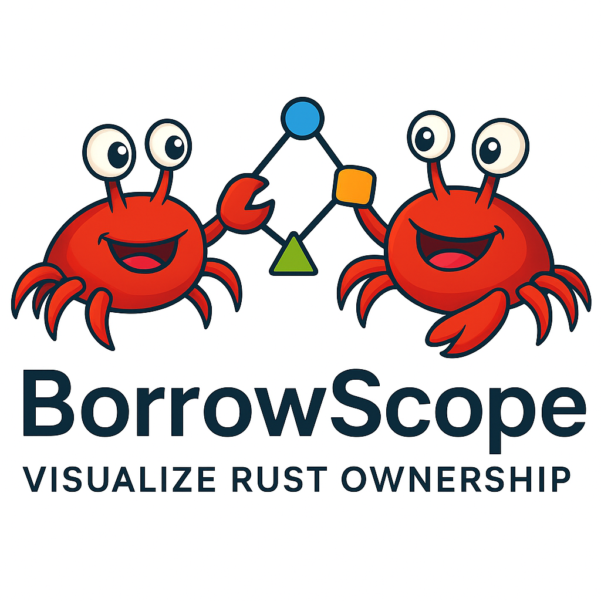

<div align="center">
  
  
  > Visualize Rust's ownership and borrowing at runtime

  [](https://github.com/mehmet-ylcnky/BorrowScope/actions)
  [](https://codecov.io/gh/mehmet-ylcnky/BorrowScope)
  [](LICENSE)
  [](https://www.rust-lang.org)
  [](https://github.com/mehmet-ylcnky/BorrowScope)
</div>

---

BorrowScope is a production-ready developer tool that makes Rust's ownership and borrowing system visible through comprehensive runtime tracking and interactive visualization. Understand complex ownership patterns, detect borrow violations, and learn Rust's memory model through visual feedback.

## ✨ Implemented Features

### Core Tracking (✅ Complete)
- **Basic Ownership Operations**
  - Variable creation and initialization
  - Move semantics tracking
  - Drop order visualization
  - Scope-based lifetime inference
  
- **Borrowing System**
  - Immutable borrows (`&T`)
  - Mutable borrows (`&mut T`)
  - Multiple simultaneous immutable borrows
  - Nested borrow tracking
  - Borrow-of-borrow chains

### Smart Pointers (✅ Complete)
- **Box\<T\>** - Heap allocation tracking
- **Rc\<T\>** - Reference counting with clone tracking
- **Arc\<T\>** - Atomic reference counting for thread safety
- **RefCell\<T\>** - Interior mutability with runtime borrow checking
- **Cell\<T\>** - Copy type interior mutability
- Reference count history and visualization
- Weak reference tracking

### Advanced Patterns (✅ Complete)
- **Async/Await** - Future and async function tracking
- **Trait Objects** - Dynamic dispatch and fat pointer handling
- **Unsafe Code** - Raw pointer operations, FFI calls, transmute tracking
- **Static & Const** - Global variable initialization and access
- **Macro-Generated Code** - Full compatibility with standard and custom macros

### Performance & Optimization (✅ Complete)
- **<500ns overhead** per tracking operation (debug builds)
- **Zero overhead** with feature flags disabled (release builds)
- **Thread-safe** implementation with minimal lock contention
- **Linear memory scaling** O(n) with operation count
- **Batch operations** for improved performance

### Testing & Quality (✅ Complete)
- **1,742 comprehensive tests** covering all features (555 runtime + 566 graph + 419 macro + 148 CLI + 54 integration)
- **Property-based testing** with PropTest and QuickCheck
- **Edge case coverage** for extreme scenarios
- **>90% code coverage** across core modules ([view report](https://mehmet-ylcnky.github.io/BorrowScope/coverage/))
  - borrowscope-graph: 91.1% regions, 92.5% functions, 94.7% lines
  - conflicts: 91.5% | lib: 91.5% | query: 92.3% | serialization: 91.7% | visualization: 89.3%
- **Zero clippy warnings** with strict linting
- **Continuous coverage tracking** via Codecov

## 🚀 Planned Features

### Visualization
- [ ] **Interactive Graph View**
  - Node-based ownership visualization
  - Directed edges for borrow relationships
  - Color-coded mutable/immutable borrows
  - Zoom, pan, and filtering capabilities
  
- [ ] **Timeline View**
  - Temporal visualization of variable lifetimes
  - Borrow duration display
  - Playback controls for event replay
  - Synchronization with graph view

- [ ] **Desktop Application (Tauri)**
  - Cross-platform native application
  - Real-time visualization updates
  - Dark/light theme support
  - Export to images and videos

### CLI & Integration
- [ ] **Command-Line Interface**
  - File analysis and instrumentation
  - Live code watching
  - Multiple export formats (JSON, SVG, PNG)
  - Configuration file support
  
- [ ] **IDE Integration**
  - VS Code extension
  - Inline borrow visualization
  - Real-time error detection
  - Code navigation from visualizations

### Advanced Analysis
- [ ] **Graph Algorithms**
  - Cycle detection in ownership graphs
  - Path finding between variables
  - Strongly connected components
  - Borrow conflict analysis
  
- [ ] **Plugin System**
  - Custom analysis plugins
  - Visualization plugins
  - Export format plugins
  - Plugin discovery and loading

### Performance & Scalability
- [ ] **Optimization**
  - Incremental analysis
  - Lazy evaluation strategies
  - Streaming processing for large codebases
  - Distributed analysis support
  
- [ ] **Cloud Integration**
  - Cloud deployment options
  - Collaborative analysis
  - CI/CD integration
  - Performance monitoring

### Distribution
- [ ] **Testing & QA**
  - Fuzzing integration
  - Mutation testing
  - End-to-end testing
  - Continuous integration pipelines
  
- [ ] **Packaging & Release**
  - Cross-platform builds (Linux, macOS, Windows)
  - Auto-update mechanism
  - Crash reporting
  - Analytics and telemetry

## 📦 Installation

### From Source (Current)
```bash
git clone https://github.com/mehmet-ylcnky/BorrowScope.git
cd BorrowScope
cargo build --release
```

### From Crates.io (Planned)
```bash
cargo install borrowscope-cli
```

## 🎯 Quick Start

### Basic Usage
```rust
use borrowscope_runtime::*;

fn main() {
    reset();
    
    let x = track_new("x", String::from("hello"));
    let r1 = track_borrow("r1", &x);
    let r2 = track_borrow("r2", &x);
    
    println!("{} {}", r1, r2);
    
    // Export tracking data
    let events = get_events();
    let graph = build_graph(&events);
    let export = ExportData::new(graph, events);
    let json = export.to_json().unwrap();
    
    println!("{}", json);
}
```

### Smart Pointer Tracking
```rust
use std::rc::Rc;
use borrowscope_runtime::*;

fn main() {
    reset();
    
    let rc = Rc::new(42);
    let tracked = track_rc_new("rc1", rc);
    
    let cloned = Rc::clone(&tracked);
    let tracked2 = track_rc_clone("rc2", "rc1", cloned);
    
    // View reference counts in events
    let events = get_events();
    println!("Events: {:?}", events);
}
```

### Async Tracking
```rust
use borrowscope_runtime::*;

#[tokio::main]
async fn main() {
    reset();
    
    let data = track_new("data", vec![1, 2, 3]);
    
    async_operation(&data).await;
    
    let events = get_events();
    println!("Async events: {:?}", events);
}

async fn async_operation(data: &Vec<i32>) {
    let _r = track_borrow("async_ref", data);
    // Async work here
}
```

## 🏗️ Project Structure

```
BorrowScope/
├── borrowscope-runtime/     # Core tracking system (✅ Complete)
│   ├── src/
│   │   ├── event.rs        # 19 event types
│   │   ├── tracker.rs      # 21 tracking functions
│   │   ├── graph.rs        # Graph data structures
│   │   ├── export.rs       # JSON export
│   │   └── error.rs        # Error handling
│   └── tests/              # 566 comprehensive tests
│
├── borrowscope-macro/       # Procedural macros (✅ Complete)
│   ├── src/
│   │   └── lib.rs          # Macro implementation
│   └── tests/              # Macro compatibility tests
│
├── borrowscope-cli/         # Command-line interface (🚧 In Progress)
│   ├── src/
│   │   ├── main.rs         # CLI entry point
│   │   ├── commands/       # Command implementations
│   │   ├── instrumentation.rs  # Code instrumentation engine
│   │   ├── utils.rs        # Temporary workspace management
│   │   ├── cargo.rs        # Cargo integration
│   │   └── ...
│   └── tests/              # 148 CLI tests
│       └── main.rs
│
└── borrowscope-ui/          # Desktop application (📋 Planned)
    └── src/
```

## 📊 Performance Metrics

| Operation | Overhead (Debug) | Overhead (Release) |
|-----------|------------------|-------------------|
| track_new | ~250-300ns | 0ns (optimized away) |
| track_borrow | ~200-250ns | 0ns (optimized away) |
| track_rc_clone | ~300-400ns | 0ns (optimized away) |
| track_refcell_borrow | ~250-350ns | 0ns (optimized away) |

**Memory Usage**: ~80-120 bytes per event, linear scaling O(n)

## 🧪 Testing

```bash
# Run all tests
cargo test --workspace --features track

# Run specific test suites
cargo test --test property_based_tests --features track
cargo test --test performance_integration_tests --features track

# Generate coverage report
cargo install cargo-llvm-cov
cargo llvm-cov --all-features --workspace --html --open

# Run benchmarks
cargo bench --workspace

# Check code quality
cargo clippy --all-targets --all-features -- -D warnings
cargo fmt --all -- --check
```

## 🤝 Contributing

We welcome contributions! Areas where you can help:

- **Testing**: Add more edge cases and property-based tests
- **Documentation**: Improve examples and API documentation
- **Visualization**: Implement graph and timeline views
- **IDE Integration**: Build VS Code extension
- **Performance**: Optimize hot paths and reduce overhead

Please read [CONTRIBUTING.md](CONTRIBUTING.md) for guidelines.

## 📚 Documentation

- [API Documentation](https://docs.rs/borrowscope-runtime)
- [User Guide](docs/user-guide.md)
- [Developer Guide](docs/developer-guide.md)
- [Architecture Overview](docs/architecture.md)

## 🎓 Learning Resources

BorrowScope is an excellent tool for:
- **Learning Rust**: Visualize ownership concepts as you learn
- **Teaching**: Demonstrate borrow checker behavior to students
- **Debugging**: Understand complex ownership issues in production code
- **Code Review**: Analyze ownership patterns in pull requests

## 📝 License

Licensed under the Apache License, Version 2.0. See [LICENSE](LICENSE) for details.

## 🙏 Acknowledgments

- Built with Rust 🦀
- Inspired by the Rust community's need for better ownership visualization
- Special thanks to all contributors

## 📈 Project Status

- **Advanced Ownership Patterns**: Complete (15/15) ✅
- **Current Focus**: Graph data structures and visualization
- **Next Milestone**: Interactive desktop application

---

<div align="center">
  <strong>Making Rust's ownership system visible, one borrow at a time.</strong>
</div>
