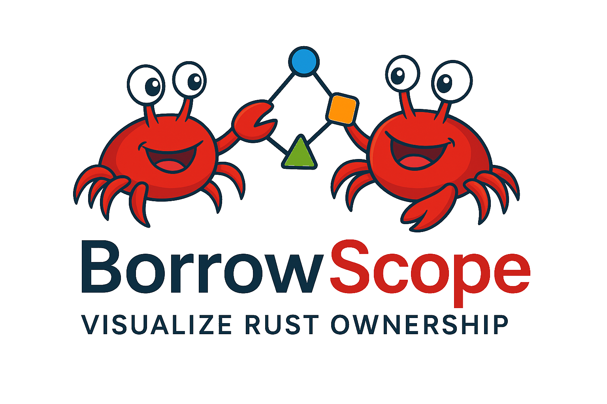

<div align="center">
  
  
  > Visualize Rust's ownership and borrowing at runtime

  [](https://github.com/mehmet-ylcnky/BorrowScope/actions)
  [](https://codecov.io/gh/mehmet-ylcnky/BorrowScope)
  [](LICENSE)
  [](https://www.rust-lang.org)
  [](https://github.com/mehmet-ylcnky/BorrowScope)
</div>

---

BorrowScope is a runtime tracking library for Rust that captures ownership transfers, borrows, and smart pointer operations as they happen. It generates structured event data that can be exported to JSON for analysis, visualization, or debugging.

## Why BorrowScope?

Rust's ownership and borrowing system is one of its most powerful features, but also one of the hardest to learn. The borrow checker operates at compile time, rejecting invalid code with error messages that can be cryptic for newcomers. Even experienced developers sometimes struggle to visualize how ownership flows through complex code paths involving smart pointers, interior mutability, or async boundaries.

BorrowScope was created to bridge this gap. By instrumenting your code with lightweight tracking calls, you can capture every ownership transfer, borrow, and drop as it happens at runtime. The resulting event stream can be exported to JSON for analysis, fed into visualization tools, or simply printed to understand what your code is actually doing. Whether you're learning Rust, teaching others, or debugging a tricky ownership issue in production code, BorrowScope makes the invisible mechanics of Rust's memory model visible.

## Installation

Add to your `Cargo.toml`:

```toml
[dependencies]
borrowscope-runtime = { path = "path/to/borrowscope-runtime", features = ["track"] }
```

The `track` feature enables runtime tracking. Without it, all tracking functions compile to no-ops with zero overhead.

## Quick Start

```rust
use borrowscope_runtime::*;

fn main() {
    reset(); // Clear any previous tracking data
    
    // Track variable creation
    let data = track_new("data", vec![1, 2, 3]);
    
    // Track borrows
    let r1 = track_borrow("r1", &data);
    let r2 = track_borrow("r2", &data);
    println!("Borrowed: {:?}, {:?}", r1, r2);
    
    // Export events as JSON
    let events = get_events();
    println!("{}", serde_json::to_string_pretty(&events).unwrap());
}
```

Output:
```json
[
  { "type": "New", "name": "data", "timestamp": 1234567890 },
  { "type": "Borrow", "name": "r1", "source": "data", "timestamp": 1234567891 },
  { "type": "Borrow", "name": "r2", "source": "data", "timestamp": 1234567892 }
]
```

## Tracking Functions

### Basic Ownership

| Function | Description |
|----------|-------------|
| `track_new(name, value)` | Track variable creation |
| `track_borrow(name, ref)` | Track immutable borrow |
| `track_borrow_mut(name, ref)` | Track mutable borrow |
| `track_move(name, value)` | Track ownership transfer |
| `track_drop(name)` | Track variable going out of scope |

### Smart Pointers

| Function | Description |
|----------|-------------|
| `track_rc_new(name, rc)` | Track `Rc<T>` creation |
| `track_rc_clone(name, source, rc)` | Track `Rc<T>` clone |
| `track_arc_new(name, arc)` | Track `Arc<T>` creation |
| `track_arc_clone(name, source, arc)` | Track `Arc<T>` clone |

### Interior Mutability

| Function | Description |
|----------|-------------|
| `track_refcell_new(name, refcell)` | Track `RefCell<T>` creation |
| `track_refcell_borrow(name, guard)` | Track `RefCell::borrow()` |
| `track_refcell_borrow_mut(name, guard)` | Track `RefCell::borrow_mut()` |
| `track_cell_new(name, cell)` | Track `Cell<T>` creation |
| `track_cell_get(name, value)` | Track `Cell::get()` |
| `track_cell_set(name)` | Track `Cell::set()` |

### Unsafe & Advanced

| Function | Description |
|----------|-------------|
| `track_raw_ptr_create(name, ptr)` | Track raw pointer creation |
| `track_raw_ptr_deref(name)` | Track raw pointer dereference |
| `track_unsafe_block_enter(name)` | Track entering unsafe block |
| `track_unsafe_block_exit(name)` | Track exiting unsafe block |
| `track_transmute(name, from, to)` | Track `std::mem::transmute` |
| `track_ffi_call(name, fn_name)` | Track FFI function calls |

### Async

| Function | Description |
|----------|-------------|
| `track_future_create(name)` | Track future creation |
| `track_future_poll(name, state)` | Track future poll |
| `track_async_block_enter(name)` | Track async block entry |
| `track_async_block_exit(name)` | Track async block exit |

All functions have `_with_id` variants that accept a custom identifier for correlation.

## Example Projects

The `examples/` directory contains standalone projects demonstrating different aspects of BorrowScope:

| Example | Description |
|---------|-------------|
| [ownership-patterns](examples/ownership-patterns/) | Basic ownership, moves, and borrows |
| [smart-pointers](examples/smart-pointers/) | `Rc`, `Arc`, `RefCell`, and `Cell` tracking |
| [borrow-conflicts](examples/borrow-conflicts/) | Scenarios that would trigger borrow checker errors |
| [async-ownership](examples/async-ownership/) | Ownership across async boundaries |
| [graph-visualization](examples/graph-visualization/) | Exporting tracking data to DOT format |
| [allocator-sim](examples/allocator-sim/) | Advanced patterns: raw pointers, FFI, unions, transmute |

Run any example:
```bash
cd examples/ownership-patterns
cargo run
```

## Project Structure

```
BorrowScope/
├── borrowscope-runtime/     # Core tracking library
│   ├── src/
│   │   ├── tracker.rs      # 41 tracking functions
│   │   ├── event.rs        # Event types and serialization
│   │   ├── graph.rs        # Graph data structures
│   │   └── export.rs       # JSON export utilities
│   └── tests/              # 555 tests
│
└── examples/               # Standalone example projects
    ├── ownership-patterns/
    ├── smart-pointers/
    ├── borrow-conflicts/
    ├── async-ownership/
    ├── graph-visualization/
    └── allocator-sim/
```

## Performance

With `track` feature enabled:
- ~75-80ns per tracking call
- ~80 bytes per event
- Linear memory scaling O(n)

Without `track` feature:
- Zero overhead - all tracking compiles away

## Testing

```bash
# Run all tests
cargo test -p borrowscope-runtime --features track

# Run specific test file
cargo test -p borrowscope-runtime --features track --test integration_tests
```

## Roadmap

Future development will add:

- **borrowscope-macro** - Procedural macros for automatic instrumentation
- **borrowscope-graph** - Graph algorithms for ownership analysis
- **borrowscope-cli** - Command-line tool for analyzing Rust projects
- **borrowscope-ui** - Interactive visualization application

## License

Licensed under the Apache License, Version 2.0. See [LICENSE](LICENSE) for details.

## Contributing

Contributions welcome! See [CONTRIBUTING.md](CONTRIBUTING.md) for guidelines.

---

<div align="center">
  <strong>Making Rust's ownership system visible, one event at a time.</strong>
</div>
