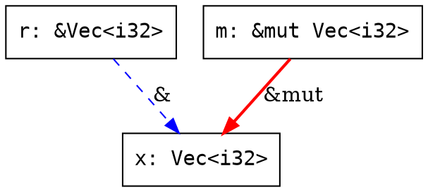

# borrowscope-graph: Implementation Plan

## Overview

`borrowscope-graph` is a standalone crate that transforms the flat event stream from `borrowscope-runtime` into a queryable ownership graph with traversal algorithms, conflict detection, and multi-format export.

---

## Milestone 1: Core Data Structures and Graph Construction ✅ COMPLETE

> **Status:** Implemented and tested. 37 tests passing.
>
> **Files:**
> - `src/node.rs` - NodeId, VariableNode, ScopeNode, ScopeKind, Node enum
> - `src/edge.rs` - EdgeId, EdgeKind (11 variants), CaptureMode, Edge
> - `src/graph.rs` - OwnershipGraph with adjacency lists, name index, add/remove/query
> - `src/builder.rs` - GraphStream (streaming), from_events (batch), GraphUpdate
> - `src/error.rs` - GraphError enum
> - `tests/milestone1.rs` - 37 comprehensive tests
### 1.1 Crate Setup and Workspace Integration

**Objective:** Create the `borrowscope-graph` crate with proper workspace configuration, dependencies, and module structure.

**Steps:**
1. Create `borrowscope-graph/Cargo.toml` with dependencies on `borrowscope-runtime`, `serde`, `serde_json`
2. Add `borrowscope-graph` to workspace `members` in root `Cargo.toml`
3. Create `src/lib.rs` with module declarations
4. Create module files: `node.rs`, `edge.rs`, `graph.rs`, `builder.rs`, `error.rs`
5. Verify `cargo build -p borrowscope-graph` compiles

**Cargo.toml:**
```toml
[package]
name = "borrowscope-graph"
version = "0.1.0"
edition = "2021"
description = "Graph algorithms for ownership analysis"

[dependencies]
borrowscope-runtime = { path = "../borrowscope-runtime", features = ["track"] }
serde = { version = "1", features = ["derive"] }
serde_json = "1"

[dev-dependencies]
pretty_assertions = "1"
```

**Module structure:**
```
borrowscope-graph/
├── Cargo.toml
├── src/
│   ├── lib.rs          # Public API re-exports
│   ├── node.rs         # NodeId, Variable, Scope, Function nodes
│   ├── edge.rs         # EdgeId, Relationship types
│   ├── graph.rs        # OwnershipGraph struct and core methods
│   ├── builder.rs      # GraphBuilder (from events or manual)
│   ├── error.rs        # GraphError enum
│   └── tests/          # Integration test modules
└── docs/
    └── IMPLEMENTATION_PLAN.md
```

**Expectation:** `cargo test -p borrowscope-graph` passes with a trivial test. The crate is importable from other workspace members.

---

### 1.2 Node Types (Variable, Scope, Function)

**Objective:** Define the node types that represent entities in the ownership graph. Each node has a unique `NodeId` and carries metadata from the event stream.

**Steps:**
1. Define `NodeId` as a newtype wrapper around `usize`
2. Define `VariableNode` with ownership-relevant metadata
3. Define `ScopeNode` for function/block scopes (provides containment)
4. Define `FunctionNode` for function boundaries
5. Define `Node` enum that wraps all node types

**Code:**
```rust
/// Opaque node identifier. Cheap to copy and compare.
#[derive(Debug, Clone, Copy, PartialEq, Eq, Hash, Serialize, Deserialize)]
pub struct NodeId(pub usize);

/// A variable in the ownership graph.
#[derive(Debug, Clone, Serialize, Deserialize)]
pub struct VariableNode {
    pub id: NodeId,
    pub name: String,
    pub type_name: String,
    pub created_at: u64,
    pub dropped_at: Option<u64>,
    pub scope_depth: u32,
    pub is_copy: bool,
    pub is_mutable: bool,
}

/// A scope boundary (function body, block, loop).
#[derive(Debug, Clone, Serialize, Deserialize)]
pub struct ScopeNode {
    pub id: NodeId,
    pub name: String,
    pub kind: ScopeKind,  // Function, Block, Loop, Match
    pub entered_at: u64,
    pub exited_at: Option<u64>,
}

/// Unified node type.
#[derive(Debug, Clone, Serialize, Deserialize)]
#[serde(tag = "node_type")]
pub enum Node {
    Variable(VariableNode),
    Scope(ScopeNode),
}

impl Node {
    pub fn id(&self) -> NodeId { ... }
    pub fn name(&self) -> &str { ... }
    pub fn is_alive_at(&self, timestamp: u64) -> bool { ... }
}
```

**Expectation:** Nodes are constructible, serializable, and provide `is_alive_at()` for temporal queries. `NodeId` is `Copy` for cheap graph operations.

---

### 1.3 Edge Types (Owns, Borrows, Moves, Clones, Captures)

**Objective:** Define edge types that represent all ownership relationships captured by the runtime's 88 event types. Edges are temporal (they have start/end timestamps).

**Steps:**
1. Define `EdgeId` newtype
2. Define `EdgeKind` enum covering all relationship types
3. Define `Edge` struct with source, target, kind, and temporal bounds
4. Implement helper methods for querying edge properties

**Code:**
```rust
#[derive(Debug, Clone, Copy, PartialEq, Eq, Hash, Serialize, Deserialize)]
pub struct EdgeId(pub usize);

#[derive(Debug, Clone, PartialEq, Serialize, Deserialize)]
pub enum EdgeKind {
    /// Immutable borrow: &T
    BorrowShared,
    /// Mutable borrow: &mut T
    BorrowMut,
    /// Ownership transfer (move)
    Move,
    /// Rc::clone (shared ownership)
    RcClone { strong_count: u32 },
    /// Arc::clone (shared ownership, thread-safe)
    ArcClone { strong_count: u32 },
    /// Weak::downgrade
    WeakDowngrade,
    /// RefCell::borrow / RefCell::borrow_mut
    RefCellBorrow { mutable: bool },
    /// Mutex/RwLock lock acquisition
    LockAcquire { lock_type: String },
    /// Closure captures a variable
    ClosureCapture { capture_mode: CaptureMode },
    /// Variable contained in scope
    ScopeContains,
    /// Channel send (ownership transfer across threads)
    ChannelSend,
}

#[derive(Debug, Clone, PartialEq, Serialize, Deserialize)]
pub enum CaptureMode {
    ByRef,
    ByMutRef,
    ByMove,
}

#[derive(Debug, Clone, Serialize, Deserialize)]
pub struct Edge {
    pub id: EdgeId,
    pub source: NodeId,
    pub target: NodeId,
    pub kind: EdgeKind,
    pub created_at: u64,
    pub ended_at: Option<u64>,
}

impl Edge {
    pub fn is_active_at(&self, timestamp: u64) -> bool { ... }
    pub fn is_borrow(&self) -> bool { ... }
    pub fn is_mutable(&self) -> bool { ... }
    pub fn duration(&self) -> Option<u64> { ... }
}
```

**Expectation:** Every runtime event that creates a relationship between two variables maps to exactly one `EdgeKind`. Edges carry temporal information for lifetime analysis.

---

### 1.4 OwnershipGraph Struct and Builder API

**Objective:** Define the central graph structure with adjacency-list storage and a fluent builder API for manual construction.

**Steps:**
1. Define `OwnershipGraph` with node/edge storage and adjacency indices
2. Implement core mutation methods (add_node, add_edge, remove_node)
3. Implement query methods (node_count, edge_count, neighbors, edges_of)
4. Define `GraphBuilder` for fluent construction

**Code:**
```rust
#[derive(Debug, Clone, Serialize, Deserialize)]
pub struct OwnershipGraph {
    nodes: Vec<Node>,
    edges: Vec<Edge>,
    /// Adjacency list: node -> outgoing edges
    outgoing: HashMap<NodeId, Vec<EdgeId>>,
    /// Reverse adjacency: node -> incoming edges
    incoming: HashMap<NodeId, Vec<EdgeId>>,
    /// Name index for lookup
    name_index: HashMap<String, Vec<NodeId>>,
    next_node_id: usize,
    next_edge_id: usize,
}

impl OwnershipGraph {
    pub fn new() -> Self;
    pub fn node_count(&self) -> usize;
    pub fn edge_count(&self) -> usize;

    // Node operations
    pub fn add_variable(&mut self, name: &str, type_name: &str, created_at: u64) -> NodeId;
    pub fn add_scope(&mut self, name: &str, kind: ScopeKind, entered_at: u64) -> NodeId;
    pub fn mark_dropped(&mut self, id: NodeId, timestamp: u64);
    pub fn get_node(&self, id: NodeId) -> Option<&Node>;
    pub fn find_by_name(&self, name: &str) -> &[NodeId];

    // Edge operations
    pub fn add_borrow(&mut self, borrower: NodeId, owner: NodeId, mutable: bool, at: u64) -> EdgeId;
    pub fn add_move(&mut self, from: NodeId, to: NodeId, at: u64) -> EdgeId;
    pub fn add_rc_clone(&mut self, clone: NodeId, source: NodeId, count: u32, at: u64) -> EdgeId;
    pub fn add_arc_clone(&mut self, clone: NodeId, source: NodeId, count: u32, at: u64) -> EdgeId;
    pub fn add_capture(&mut self, closure: NodeId, var: NodeId, mode: CaptureMode, at: u64) -> EdgeId;
    pub fn end_edge(&mut self, id: EdgeId, timestamp: u64);
    pub fn get_edge(&self, id: EdgeId) -> Option<&Edge>;

    // Query operations
    pub fn outgoing_edges(&self, id: NodeId) -> &[EdgeId];
    pub fn incoming_edges(&self, id: NodeId) -> &[EdgeId];
    pub fn neighbors(&self, id: NodeId) -> Vec<NodeId>;
    pub fn borrowers_of(&self, id: NodeId) -> Vec<NodeId>;
    pub fn owner_of(&self, id: NodeId) -> Option<NodeId>;
}
```

**Expectation:** The graph supports O(1) node/edge lookup by ID, O(1) adjacency queries, and O(n) name lookups. The builder methods return IDs for chaining.

---

### 1.5 Event-to-Graph Construction (`from_events`)

**Objective:** Automatically construct an `OwnershipGraph` from a `Vec<Event>` produced by `borrowscope-runtime`. This is the primary entry point for most users.

**Steps:**
1. Iterate events in timestamp order
2. Map `Event::New` to `add_variable()`
3. Map `Event::Borrow` to `add_borrow()`
4. Map `Event::Move` to `add_move()`
5. Map `Event::Drop` to `mark_dropped()` and `end_edge()` for active borrows
6. Map `Event::RcClone`/`ArcClone` to `add_rc_clone()`/`add_arc_clone()`
7. Map `Event::ClosureCapture` to `add_capture()`
8. Map scope events (`FnEnter`/`FnExit`, `RegionEnter`/`RegionExit`) to scope nodes
9. Track active borrows in a HashMap for edge termination on drop

**Code:**
```rust
impl OwnershipGraph {
    /// Build a graph from a runtime event stream.
    pub fn from_events(events: &[Event]) -> Self {
        let mut graph = Self::new();
        let mut var_ids: HashMap<String, NodeId> = HashMap::new();
        let mut active_borrows: HashMap<String, Vec<EdgeId>> = HashMap::new();

        for event in events {
            match event {
                Event::New { var_name, type_name, timestamp, .. } => {
                    let id = graph.add_variable(var_name, type_name, *timestamp);
                    var_ids.insert(var_name.clone(), id);
                }
                Event::Borrow { var_name, source, mutable, timestamp, .. } => {
                    if let (Some(&borrower), Some(&owner)) =
                        (var_ids.get(var_name), var_ids.get(source))
                    {
                        let eid = graph.add_borrow(borrower, owner, *mutable, *timestamp);
                        active_borrows.entry(var_name.clone()).or_default().push(eid);
                    }
                }
                Event::Drop { var_name, timestamp, .. } => {
                    if let Some(&id) = var_ids.get(var_name) {
                        graph.mark_dropped(id, *timestamp);
                        // End all borrows held by this variable
                        if let Some(edges) = active_borrows.remove(var_name) {
                            for eid in edges {
                                graph.end_edge(eid, *timestamp);
                            }
                        }
                    }
                }
                Event::RcClone { var_name, source, strong_count, timestamp, .. } => {
                    if let (Some(&clone_id), Some(&src_id)) =
                        (var_ids.get(var_name), var_ids.get(source))
                    {
                        graph.add_rc_clone(clone_id, src_id, *strong_count, *timestamp);
                    }
                }
                // ... remaining event types
                _ => {}
            }
        }
        graph
    }
}
```

**Expectation:** Given the event stream from any `#[trace_borrow]`-instrumented function, `from_events` produces a graph where:
- Every `New` event creates a node
- Every `Borrow` event creates an edge between borrower and owner
- Every `Drop` event terminates the node and its active edges
- Smart pointer events create the appropriate clone/downgrade edges

---

### 1.6 Incremental Graph Updates (add/remove nodes and edges)

**Objective:** Support modifying an existing graph after construction. This enables streaming use cases where events arrive one at a time, and interactive tools that allow manual graph editing.

**Steps:**
1. Implement `push_event(&mut self, event: &Event)` for streaming construction
2. Implement `remove_node(id)` that also removes connected edges
3. Implement `remove_edge(id)` that updates adjacency lists
4. Implement `merge(other: &OwnershipGraph)` for combining graphs from multiple functions
5. Maintain index consistency on all mutations

**Code:**
```rust
impl OwnershipGraph {
    /// Process a single event, updating the graph incrementally.
    /// Returns the NodeId or EdgeId created, if any.
    pub fn push_event(&mut self, event: &Event) -> Option<GraphUpdate>;

    /// Remove a node and all its connected edges.
    pub fn remove_node(&mut self, id: NodeId);

    /// Remove a single edge.
    pub fn remove_edge(&mut self, id: EdgeId);

    /// Merge another graph into this one. Node IDs are remapped.
    pub fn merge(&mut self, other: &OwnershipGraph) -> NodeIdMapping;
}

#[derive(Debug)]
pub enum GraphUpdate {
    NodeAdded(NodeId),
    EdgeAdded(EdgeId),
    NodeDropped(NodeId),
    EdgeEnded(EdgeId),
    NoOp,
}
```

**Expectation:** After any sequence of `push_event` calls, the graph is identical to one built via `from_events` with the same events. `remove_node` leaves no dangling edge references. `merge` produces a valid combined graph with no ID collisions.

---

### 1.T Testing: Core Data Structures

- Node creation and field access
- Edge creation with all relationship variants
- Builder API: add/remove/query nodes and edges
- `from_events` with synthetic event streams (basic ownership, smart pointers, moves)
- Incremental updates: add node to existing graph, remove dropped variable
- Round-trip: build graph from events, verify node/edge counts match expected
- Edge cases: empty event stream, single variable, duplicate names (shadowing)
- `push_event` produces same graph as `from_events` for identical event sequences
- `merge` two disjoint graphs: node count = sum, no edge cross-references
- Serialization: `OwnershipGraph` round-trips through JSON without data loss

---

## Milestone 2: Graph Traversal Algorithms ✅ COMPLETE

> **Status:** Implemented and tested. 38 tests passing.
>
> **Files:**
> - `src/traversal.rs` - DFS, BFS, shortest path, topological order, reachability, components, borrow chain
> - `src/graph.rs` - Added `Direction` enum and `neighbors_directed` method
> - `tests/milestone2.rs` - 38 comprehensive tests

### 2.1 Depth-First Search (DFS)

**Objective:** Implement DFS traversal that visits all reachable nodes from a starting node, following ownership edges. DFS is the foundation for cycle detection, topological sorting, and reachability queries.

**Steps:**
1. Create `src/traversal.rs` module
2. Implement iterative DFS (avoid stack overflow on deep graphs)
3. Support direction control: follow outgoing edges, incoming edges, or both
4. Return visit order as `Vec<NodeId>`
5. Support early termination via a predicate

**Code:**
```rust
/// Direction for traversal.
#[derive(Debug, Clone, Copy)]
pub enum Direction {
    Outgoing,  // Follow edges from source to target
    Incoming,  // Follow edges from target to source
    Both,      // Follow edges in both directions
}

/// DFS traversal from a starting node.
/// Returns nodes in visit order (pre-order).
pub fn dfs(graph: &OwnershipGraph, start: NodeId, direction: Direction) -> Vec<NodeId> {
    let mut visited = HashSet::new();
    let mut stack = vec![start];
    let mut order = Vec::new();

    while let Some(node) = stack.pop() {
        if !visited.insert(node) {
            continue;
        }
        order.push(node);
        for neighbor in graph.neighbors_directed(node, direction) {
            if !visited.contains(&neighbor) {
                stack.push(neighbor);
            }
        }
    }
    order
}

/// DFS with early termination. Stops when predicate returns true.
pub fn dfs_until(
    graph: &OwnershipGraph,
    start: NodeId,
    direction: Direction,
    predicate: impl Fn(NodeId) -> bool,
) -> Option<Vec<NodeId>>;
```

**Expectation:** DFS visits each reachable node exactly once. On a linear chain A->B->C, returns `[A, B, C]`. On a diamond (A->B, A->C, B->D, C->D), visits D only once.

---

### 2.2 Breadth-First Search (BFS)

**Objective:** Implement BFS traversal that visits nodes level-by-level. BFS finds shortest paths in unweighted graphs and is useful for finding the closest owner or borrower.

**Steps:**
1. Implement BFS using a `VecDeque`
2. Track distance (level) for each visited node
3. Return `Vec<(NodeId, u32)>` with node and distance from start

**Code:**
```rust
/// BFS traversal returning nodes with their distance from start.
pub fn bfs(graph: &OwnershipGraph, start: NodeId, direction: Direction) -> Vec<(NodeId, u32)> {
    let mut visited = HashSet::new();
    let mut queue = VecDeque::new();
    let mut result = Vec::new();

    visited.insert(start);
    queue.push_back((start, 0));

    while let Some((node, dist)) = queue.pop_front() {
        result.push((node, dist));
        for neighbor in graph.neighbors_directed(node, direction) {
            if visited.insert(neighbor) {
                queue.push_back((neighbor, dist + 1));
            }
        }
    }
    result
}
```

**Expectation:** BFS returns nodes ordered by distance. All nodes at distance 1 appear before distance 2. On a tree, this is level-order traversal.

---

### 2.3 Shortest Path Between Variables

**Objective:** Find the shortest ownership path between two variables. This answers questions like "how is variable X related to variable Y?" by showing the chain of borrows, moves, or clones connecting them.

**Steps:**
1. Implement BFS-based shortest path (unweighted)
2. Track parent pointers for path reconstruction
3. Return `Option<Vec<NodeId>>` (None if unreachable)
4. Include edge information in the path for richer output

**Code:**
```rust
/// Find shortest path between two nodes.
/// Returns None if no path exists.
pub fn shortest_path(
    graph: &OwnershipGraph,
    from: NodeId,
    to: NodeId,
) -> Option<Vec<NodeId>>;

/// Shortest path with edge details.
pub fn shortest_path_with_edges(
    graph: &OwnershipGraph,
    from: NodeId,
    to: NodeId,
) -> Option<Vec<(NodeId, Option<EdgeId>)>>;
```

**Expectation:** Returns the minimum-hop path. If A borrows B which borrows C, `shortest_path(A, C)` returns `[A, B, C]` (length 2). Returns `None` for disconnected nodes. `shortest_path(x, x)` returns `[x]`.

---

### 2.4 Topological Ordering (Drop Order)

**Objective:** Compute a topological ordering of the graph that represents the valid drop order. In Rust, variables are dropped in reverse declaration order within a scope, and borrowers must be dropped before owners.

**Steps:**
1. Implement Kahn's algorithm (BFS-based topological sort)
2. Handle cycles gracefully (return error or partial order)
3. Use borrow edges as ordering constraints: borrower must come before owner in drop order
4. Verify ordering matches Rust's actual drop semantics

**Code:**
```rust
/// Compute topological order (valid drop order).
/// Returns Err if the graph contains cycles (e.g., Rc reference cycles).
pub fn topological_order(graph: &OwnershipGraph) -> Result<Vec<NodeId>, CycleError>;

/// Drop order: reverse topological order (last created, first dropped).
pub fn drop_order(graph: &OwnershipGraph) -> Result<Vec<NodeId>, CycleError>;

#[derive(Debug)]
pub struct CycleError {
    /// Nodes involved in the cycle
    pub cycle: Vec<NodeId>,
}
```

**Expectation:** For a simple borrow `let x = 1; let r = &x;`, drop order is `[r, x]` (borrower dropped first). For Rc cycles, returns `CycleError` with the cycle participants.

---

### 2.5 Reachability Queries (`can_reach`)

**Objective:** Determine whether one variable can reach another through any chain of ownership edges. This is a fundamental building block for conflict detection and lifetime analysis.

**Steps:**
1. Implement `can_reach(from, to)` using DFS with early termination
2. Implement `all_reachable(from)` returning the full reachable set
3. Cache results for repeated queries (optional, behind a feature flag)

**Code:**
```rust
/// Check if `to` is reachable from `from` following edges.
pub fn can_reach(graph: &OwnershipGraph, from: NodeId, to: NodeId) -> bool;

/// Get all nodes reachable from `start`.
pub fn all_reachable(graph: &OwnershipGraph, start: NodeId, direction: Direction) -> HashSet<NodeId>;

/// Check if two nodes are in the same connected component.
pub fn are_connected(graph: &OwnershipGraph, a: NodeId, b: NodeId) -> bool;
```

**Expectation:** `can_reach(a, a)` is always true. If A->B->C exists, `can_reach(A, C)` is true. `can_reach(C, A)` is false unless there's a back-edge (cycle).

---

### 2.6 Connected Components

**Objective:** Partition the graph into connected components. Each component represents an independent ownership cluster. Variables in different components have no ownership relationship.

**Steps:**
1. Implement union-find (disjoint set) for efficient component tracking
2. Treat edges as undirected for component detection
3. Return `Vec<Vec<NodeId>>` grouped by component
4. Provide `component_of(node)` for single-node queries

**Code:**
```rust
/// Find all connected components (treating edges as undirected).
pub fn connected_components(graph: &OwnershipGraph) -> Vec<Vec<NodeId>>;

/// Get the component ID for a specific node.
pub fn component_of(graph: &OwnershipGraph, node: NodeId) -> usize;

/// Number of connected components.
pub fn component_count(graph: &OwnershipGraph) -> usize;
```

**Expectation:** A graph with 3 isolated variables has 3 components. A variable and its borrower are in the same component. Two unrelated functions produce separate components.

---

### 2.7 Borrow Chain and Borrow Depth

**Objective:** Compute the borrow chain (sequence of borrows from a variable to its ultimate owner) and borrow depth (how many levels of indirection exist). This helps visualize nested borrowing patterns like `&&&&x`.

**Steps:**
1. Follow incoming borrow edges from a node to find its owner
2. Recursively follow until reaching a node with no incoming borrow edges (the root owner)
3. Compute depth as the length of this chain
4. Return the full chain for visualization

**Code:**
```rust
/// Get the chain of borrows from a variable back to its root owner.
/// Returns [variable, ..., root_owner] where each step is a borrow relationship.
pub fn borrow_chain(graph: &OwnershipGraph, node: NodeId) -> Vec<NodeId>;

/// Depth of borrow nesting (0 = owner, 1 = direct borrow, 2 = borrow of borrow).
pub fn borrow_depth(graph: &OwnershipGraph, node: NodeId) -> u32;

/// Find the root owner of a borrowed variable.
pub fn root_owner(graph: &OwnershipGraph, node: NodeId) -> NodeId;
```

**Expectation:** For `let x = 1; let r = &x; let rr = &r;`, `borrow_chain(rr)` returns `[rr, r, x]` and `borrow_depth(rr)` returns 2. For an owner with no borrows, `borrow_chain(x)` returns `[x]` and depth is 0.

---

### 2.T Testing: Traversal Algorithms

- DFS/BFS: verify visit order on known graph topologies (linear, tree, diamond, cycle)
- DFS: all nodes visited exactly once, even with multiple paths to same node
- BFS: distance values are monotonically non-decreasing in result
- Shortest path: disconnected nodes return None, self-path is `[x]`, verify path correctness
- Shortest path: on diamond graph, returns either valid shortest path (length 2)
- Topological order: verify drop order matches reverse creation order for simple cases
- Topological order: borrower always appears before owner in result
- Topological order: Rc cycle returns CycleError with correct participants
- Reachability: transitive closure correctness, unreachable returns false
- Reachability: `can_reach(x, x)` always true
- Connected components: isolated variables form separate components, borrows connect
- Connected components: count matches expected for known graphs
- Borrow chain: depth calculation for nested borrows (e.g., `&&x` = depth 2)
- Borrow chain: owner has depth 0, direct borrow has depth 1
- Root owner: follows chain to the non-borrowed variable
- Performance: traversal on graph with 10,000 nodes completes in < 100ms
- Empty graph: all traversal functions return empty results without panicking

---

## Milestone 3: Conflict Detection and Validation ✅ COMPLETE

> **Status:** Implemented and tested. 32 tests passing.
>
> **Files:**
> - `src/conflict.rs` - Active borrows, conflict detection, timeline, cycle detection, validation, use-after-move, dangling pointers
> - `tests/milestone3.rs` - 32 comprehensive tests

### 3.1 Active Borrows at Timestamp

**Objective:** Given a timestamp, return all borrow edges that are active (started but not yet ended). This is the foundation for conflict detection: two borrows conflict only if they overlap in time.

**Steps:**
1. Create `src/conflict.rs` module
2. Filter edges by `edge.is_borrow() && edge.is_active_at(timestamp)`
3. Group active borrows by their target (the variable being borrowed)
4. Return a map from owner NodeId to active borrow edges

**Code:**
```rust
/// All active borrows at a given timestamp, grouped by the borrowed variable.
pub fn active_borrows_at(
    graph: &OwnershipGraph,
    timestamp: u64,
) -> HashMap<NodeId, Vec<&Edge>> {
    let mut result: HashMap<NodeId, Vec<&Edge>> = HashMap::new();
    for edge in graph.edges() {
        if edge.is_borrow() && edge.is_active_at(timestamp) {
            result.entry(edge.target).or_default().push(edge);
        }
    }
    result
}

/// Active borrows on a specific variable at a timestamp.
pub fn borrows_on_at(
    graph: &OwnershipGraph,
    owner: NodeId,
    timestamp: u64,
) -> Vec<&Edge>;
```

**Expectation:** If variable `x` has an immutable borrow from t=10 to t=50 and a mutable borrow from t=60 to t=90, querying at t=30 returns only the immutable borrow. Querying at t=55 returns nothing.

---

### 3.2 Mutable/Immutable Borrow Conflict Detection

**Objective:** Detect violations of Rust's borrowing rules: either one `&mut` OR any number of `&`, but not both simultaneously. While the Rust compiler prevents these at compile time, runtime tracking can detect patterns that would conflict if the borrow checker were not present (useful for educational visualization).

**Steps:**
1. For each variable, collect all borrow edges sorted by start time
2. Use an interval overlap algorithm to find conflicting pairs
3. A conflict exists when: (a) two `&mut` borrows overlap, or (b) a `&mut` and a `&` overlap
4. Return conflict descriptors with the involved edges and overlap window

**Code:**
```rust
#[derive(Debug, Clone, Serialize, Deserialize)]
pub struct BorrowConflict {
    /// The variable being borrowed
    pub owner: NodeId,
    /// First conflicting borrow
    pub borrow_a: EdgeId,
    /// Second conflicting borrow
    pub borrow_b: EdgeId,
    /// Start of the overlap window
    pub conflict_start: u64,
    /// End of the overlap window
    pub conflict_end: u64,
    /// Type of conflict
    pub kind: ConflictKind,
}

#[derive(Debug, Clone, Serialize, Deserialize)]
pub enum ConflictKind {
    /// &mut + & on same variable
    MutableAndShared,
    /// &mut + &mut on same variable
    MultipleMutable,
}

/// Find all borrow conflicts in the graph.
pub fn find_conflicts(graph: &OwnershipGraph) -> Vec<BorrowConflict> {
    let mut conflicts = Vec::new();
    // Group borrow edges by target (owner)
    let borrows_by_owner = group_borrows_by_target(graph);

    for (owner, borrows) in &borrows_by_owner {
        // Sort by start time
        let mut sorted = borrows.clone();
        sorted.sort_by_key(|e| e.created_at);

        // Sweep line: check each pair for overlap
        for i in 0..sorted.len() {
            for j in (i + 1)..sorted.len() {
                if let Some(conflict) = check_overlap(&sorted[i], &sorted[j], *owner) {
                    conflicts.push(conflict);
                }
            }
        }
    }
    conflicts
}

/// Check conflicts at a specific timestamp.
pub fn conflicts_at(graph: &OwnershipGraph, timestamp: u64) -> Vec<BorrowConflict>;
```

**Expectation:** Two simultaneous `&x` borrows produce no conflict. A `&x` and `&mut x` overlapping in time produce a `MutableAndShared` conflict. Non-overlapping borrows (even `&mut` followed by `&mut`) produce no conflict.

---

### 3.3 Conflict Timeline Generation

**Objective:** Produce a timeline showing when conflicts exist and when they resolve. This enables visualization of borrow conflicts over the program's execution.

**Steps:**
1. Collect all borrow start/end events as timeline points
2. At each point, recompute the active borrow set
3. Mark intervals where conflicts exist
4. Return a list of conflict windows with start/end timestamps

**Code:**
```rust
#[derive(Debug, Clone, Serialize, Deserialize)]
pub struct ConflictWindow {
    pub owner: NodeId,
    pub start: u64,
    pub end: u64,
    pub kind: ConflictKind,
    pub active_borrows: Vec<EdgeId>,
}

/// Generate a timeline of all conflict windows.
pub fn conflict_timeline(graph: &OwnershipGraph) -> Vec<ConflictWindow>;

/// Check if any conflicts exist at a specific timestamp.
pub fn has_conflicts_at(graph: &OwnershipGraph, timestamp: u64) -> bool;
```

**Expectation:** A program with no overlapping mutable borrows produces an empty timeline. A program where `&mut x` and `&x` overlap from t=20 to t=40 produces one window `{start: 20, end: 40}`.

---

### 3.4 Cycle Detection (Reference Cycles via Rc/Arc)

**Objective:** Detect reference cycles created through `Rc`/`Arc` clones. Cycles cause memory leaks because the reference count never reaches zero. This uses DFS with back-edge detection.

**Steps:**
1. Build a subgraph containing only `RcClone` and `ArcClone` edges
2. Run DFS with coloring (white/gray/black) to detect back-edges
3. When a back-edge is found, extract the cycle by tracing the DFS stack
4. Return all detected cycles

**Code:**
```rust
#[derive(Debug, Clone)]
pub struct ReferenceCycle {
    /// Nodes forming the cycle, in order
    pub nodes: Vec<NodeId>,
    /// Edges forming the cycle
    pub edges: Vec<EdgeId>,
    /// Whether this is Rc (single-threaded) or Arc (multi-threaded)
    pub is_arc: bool,
}

/// Detect reference cycles in Rc/Arc clone relationships.
pub fn detect_reference_cycles(graph: &OwnershipGraph) -> Vec<ReferenceCycle>;

/// Check if a specific node participates in a reference cycle.
pub fn is_in_cycle(graph: &OwnershipGraph, node: NodeId) -> bool;
```

**Expectation:** A linear Rc chain (A clones to B clones to C) has no cycle. If A clones to B and B clones to A (through interior mutability), a cycle `[A, B]` is detected.

---

### 3.5 Graph Validation (Invariant Checking)

**Objective:** Verify that the graph satisfies ownership invariants. A valid graph should not contain impossible states (e.g., a borrow that outlives its owner, or a move from a variable that still has active borrows).

**Steps:**
1. Check: no borrow edge has `ended_at > owner.dropped_at`
2. Check: no move edge exists while active borrows exist on the source
3. Check: every edge references valid node IDs
4. Check: no node has two active `&mut` borrows at any timestamp
5. Return a list of violations with descriptive messages

**Code:**
```rust
#[derive(Debug, Clone)]
pub struct ValidationError {
    pub kind: ValidationErrorKind,
    pub message: String,
    pub nodes: Vec<NodeId>,
    pub edges: Vec<EdgeId>,
}

#[derive(Debug, Clone)]
pub enum ValidationErrorKind {
    BorrowOutlivesOwner,
    MoveWhileBorrowed,
    DanglingEdgeReference,
    InvalidTimestamps,
    DuplicateNodeId,
}

/// Validate graph invariants. Returns empty vec if valid.
pub fn validate(graph: &OwnershipGraph) -> Vec<ValidationError>;

/// Quick check: is the graph valid?
pub fn is_valid(graph: &OwnershipGraph) -> bool {
    validate(graph).is_empty()
}
```

**Expectation:** A graph built from `from_events` with valid Rust code always passes validation. Manually constructed graphs with impossible states (borrow outliving owner) produce specific `ValidationError` entries.

---

### 3.6 Use-After-Move Detection

**Objective:** Detect cases where a variable is accessed (borrowed or used) after it has been moved. While Rust prevents this at compile time, the runtime graph can visualize the move boundary for educational purposes.

**Steps:**
1. For each variable with an outgoing `Move` edge, record the move timestamp
2. Check if any borrow or access edge on that variable has `created_at > move_timestamp`
3. Report as a use-after-move violation

**Code:**
```rust
#[derive(Debug, Clone)]
pub struct UseAfterMove {
    pub variable: NodeId,
    pub moved_at: u64,
    pub move_edge: EdgeId,
    pub used_at: u64,
    pub use_edge: EdgeId,
}

/// Detect use-after-move patterns.
pub fn detect_use_after_move(graph: &OwnershipGraph) -> Vec<UseAfterMove>;
```

**Expectation:** If variable `x` is moved at t=50 and then borrowed at t=60, a `UseAfterMove` is reported. If `x` is borrowed at t=30 (before the move), no violation.

---

### 3.7 Double-Free / Dangling Pointer Detection

**Objective:** Detect cases where a variable has multiple `Drop` events or where a raw pointer is dereferenced after its source has been dropped.

**Steps:**
1. Check for nodes with `dropped_at` set that also have later events
2. Check for raw pointer dereference edges where the source node is already dropped
3. Report as dangling pointer violations

**Code:**
```rust
#[derive(Debug, Clone)]
pub struct DanglingAccess {
    pub pointer: NodeId,
    pub source: NodeId,
    pub source_dropped_at: u64,
    pub access_at: u64,
}

/// Detect dangling pointer accesses (deref after source dropped).
pub fn detect_dangling_pointers(graph: &OwnershipGraph) -> Vec<DanglingAccess>;

/// Detect variables that appear to be dropped multiple times.
pub fn detect_double_free(graph: &OwnershipGraph) -> Vec<(NodeId, Vec<u64>)>;
```

**Expectation:** In safe Rust, these should never occur. They are relevant for unsafe code tracking where `Box::into_raw` / `Box::from_raw` patterns may produce dangling pointers if misused.

---

### 3.T Testing: Conflict Detection

- Active borrows: verify correct set at various timestamps (before, during, after borrow)
- Active borrows: empty result for timestamps outside any borrow window
- Conflict detection: overlapping `&mut` + `&` on same variable detected as `MutableAndShared`
- Conflict detection: two simultaneous `&mut` detected as `MultipleMutable`
- Conflict detection: non-overlapping borrows produce no conflicts
- Conflict detection: multiple `&` borrows simultaneously produce no conflicts
- Conflict timeline: verify start/end times of each conflict window
- Conflict timeline: empty for valid Rust programs (no overlapping mut borrows)
- Cycle detection: Rc cycle (A -> B -> A) detected with correct node list
- Cycle detection: linear Rc chain not flagged as cycle
- Cycle detection: self-referential Rc (A -> A) detected
- Validation: well-formed graph passes (empty error list)
- Validation: graph with borrow outliving owner produces `BorrowOutlivesOwner`
- Validation: graph with dangling edge reference produces `DanglingEdgeReference`
- Use-after-move: access after move event detected with correct timestamps
- Use-after-move: access before move not flagged
- Double-free: two Drop events for same variable detected
- Dangling pointer: deref after source dropped detected
- False positive rate: valid Rust patterns (reborrow, split borrow) not flagged
- Performance: conflict detection on 1000-edge graph completes in < 50ms

---

## Milestone 4: Temporal Queries and Lifetime Analysis ✅ COMPLETE

> **Status:** Implemented and tested. 33 tests passing.
>
> **Files:**
> - `src/temporal.rs` - Lifetime spans, overlapping lifetimes, snapshots, borrow scopes, ownership timelines, ref count history
> - `tests/milestone4.rs` - 33 comprehensive tests

### 4.1 Variable Lifetime Spans

**Objective:** Compute the lifetime span of each variable as a `(created_at, dropped_at)` interval. Variables that are never dropped (still alive at program end) have an open-ended span. This is the building block for all temporal queries.

**Steps:**
1. Create `src/temporal.rs` module
2. Define `LifetimeSpan` struct with start, end, and duration
3. Compute spans from node metadata (`created_at`, `dropped_at`)
4. Provide bulk query: all lifetimes sorted by start time

**Code:**
```rust
#[derive(Debug, Clone, Serialize, Deserialize)]
pub struct LifetimeSpan {
    pub node: NodeId,
    pub name: String,
    pub start: u64,
    pub end: Option<u64>,
}

impl LifetimeSpan {
    /// Duration in timestamp units. None if still alive.
    pub fn duration(&self) -> Option<u64> {
        self.end.map(|e| e - self.start)
    }

    /// Whether this span is alive at the given timestamp.
    pub fn is_alive_at(&self, timestamp: u64) -> bool {
        timestamp >= self.start && self.end.map_or(true, |e| timestamp < e)
    }

    /// Whether this span overlaps with another.
    pub fn overlaps(&self, other: &LifetimeSpan) -> bool {
        let self_end = self.end.unwrap_or(u64::MAX);
        let other_end = other.end.unwrap_or(u64::MAX);
        self.start < other_end && other.start < self_end
    }
}

/// Get lifetime spans for all variables in the graph.
pub fn all_lifetimes(graph: &OwnershipGraph) -> Vec<LifetimeSpan>;

/// Get lifetime span for a specific variable.
pub fn lifetime_of(graph: &OwnershipGraph, node: NodeId) -> Option<LifetimeSpan>;
```

**Expectation:** A variable created at t=10 and dropped at t=50 has duration 40. A variable never dropped has `end: None` and `duration(): None`. `is_alive_at(30)` returns true for the first variable.

---

### 4.2 Overlapping Lifetimes

**Objective:** Find all pairs of variables whose lifetimes overlap. This identifies which variables coexist in memory simultaneously, which is relevant for stack frame analysis and borrow compatibility.

**Steps:**
1. Sort lifetimes by start time
2. Use a sweep-line algorithm: maintain a set of currently-alive variables
3. When a new variable starts, it overlaps with all currently-alive variables
4. When a variable ends, remove it from the active set
5. Return overlap pairs or a full overlap matrix

**Code:**
```rust
/// Find all pairs of variables with overlapping lifetimes.
pub fn overlapping_lifetimes(graph: &OwnershipGraph) -> Vec<(NodeId, NodeId)>;

/// Check if two specific variables have overlapping lifetimes.
pub fn lifetimes_overlap(
    graph: &OwnershipGraph,
    a: NodeId,
    b: NodeId,
) -> bool;

/// Find all variables whose lifetime overlaps with a given variable.
pub fn contemporaries(graph: &OwnershipGraph, node: NodeId) -> Vec<NodeId>;
```

**Expectation:** Two variables alive from t=0..100 and t=50..150 overlap. Two variables alive from t=0..50 and t=60..100 do not overlap. `contemporaries(x)` returns all variables alive at any point during x's lifetime.

---

### 4.3 Active Variables at Timestamp

**Objective:** Return a snapshot of all variables alive at a specific point in time. This enables "time travel" debugging where the user can inspect the ownership state at any moment during execution.

**Steps:**
1. Filter all nodes where `created_at <= timestamp` and (`dropped_at` is None or `dropped_at > timestamp`)
2. Include metadata about active borrows on each variable
3. Support range queries: variables alive during an interval `[start, end]`

**Code:**
```rust
/// Snapshot of ownership state at a timestamp.
#[derive(Debug, Clone)]
pub struct OwnershipSnapshot {
    pub timestamp: u64,
    pub alive_variables: Vec<NodeId>,
    pub active_borrows: Vec<EdgeId>,
    pub active_locks: Vec<EdgeId>,
}

/// Get ownership snapshot at a specific timestamp.
pub fn snapshot_at(graph: &OwnershipGraph, timestamp: u64) -> OwnershipSnapshot;

/// Get all variables alive at a timestamp.
pub fn alive_at(graph: &OwnershipGraph, timestamp: u64) -> Vec<NodeId>;

/// Get variables alive throughout an entire interval.
pub fn alive_during(graph: &OwnershipGraph, start: u64, end: u64) -> Vec<NodeId>;
```

**Expectation:** At t=0 before any events, `alive_at` returns empty. After a `New` event at t=10, querying t=15 includes that variable. After its `Drop` at t=50, querying t=55 excludes it.

---

### 4.4 Borrow Scope Computation

**Objective:** For each borrow edge, compute its effective scope: the interval from when the borrow is created to when it is last used (not just when the borrow variable is dropped). This matches Rust's Non-Lexical Lifetimes (NLL) semantics.

**Steps:**
1. For each borrow edge, find the last usage of the borrower variable (from `usages` in type-info or from subsequent events)
2. The effective scope ends at `max(last_usage, dropped_at)`
3. If no usage data is available, fall back to `dropped_at`
4. Return borrow scopes as intervals

**Code:**
```rust
#[derive(Debug, Clone)]
pub struct BorrowScope {
    pub edge: EdgeId,
    pub borrower: NodeId,
    pub owner: NodeId,
    pub mutable: bool,
    pub start: u64,
    /// Effective end (last use, not necessarily drop)
    pub effective_end: u64,
    /// Actual drop time of the borrower
    pub drop_time: Option<u64>,
}

/// Compute borrow scopes for all borrow edges.
pub fn borrow_scopes(graph: &OwnershipGraph) -> Vec<BorrowScope>;

/// Get the borrow scope for a specific edge.
pub fn borrow_scope_of(graph: &OwnershipGraph, edge: EdgeId) -> Option<BorrowScope>;
```

**Expectation:** If a borrow is created at t=10, last used at t=30, and dropped at t=50, the effective scope is `[10, 30]` (NLL) rather than `[10, 50]` (lexical). Without usage data, falls back to `[10, 50]`.

---

### 4.5 Ownership Transfer Timeline

**Objective:** For a given variable, produce a timeline showing all ownership transfers (moves) it participates in. This traces the "life" of a value as it moves between variable names.

**Steps:**
1. Starting from a variable, follow outgoing `Move` edges to find the next owner
2. Recursively follow until no more moves exist
3. Build a timeline of `(variable, start, end)` entries
4. Support reverse lookup: given any variable in the chain, find the original creator

**Code:**
```rust
#[derive(Debug, Clone)]
pub struct OwnershipTransfer {
    pub from: NodeId,
    pub to: NodeId,
    pub timestamp: u64,
    pub edge: EdgeId,
}

#[derive(Debug, Clone)]
pub struct OwnershipTimeline {
    /// The original creator of the value
    pub origin: NodeId,
    /// Ordered list of transfers
    pub transfers: Vec<OwnershipTransfer>,
    /// Current owner (last in chain, or origin if never moved)
    pub current_owner: NodeId,
}

/// Build the ownership timeline for a value, starting from its origin.
pub fn ownership_timeline(graph: &OwnershipGraph, origin: NodeId) -> OwnershipTimeline;

/// Find the original creator of a value (trace moves backward).
pub fn find_origin(graph: &OwnershipGraph, node: NodeId) -> NodeId;

/// Find the current owner of a value (trace moves forward).
pub fn find_current_owner(graph: &OwnershipGraph, node: NodeId) -> NodeId;
```

**Expectation:** For `let a = vec![1]; let b = a; let c = b;`, the timeline starting from `a` shows transfers `a->b` at t1 and `b->c` at t2. `find_origin(c)` returns `a`. `find_current_owner(a)` returns `c`.

---

### 4.6 Reference Count History (Rc/Arc)

**Objective:** Track the reference count of an `Rc`/`Arc` value over time. Each clone increments the count, each drop decrements it. This enables visualization of shared ownership lifecycles and detection of leaks (count never reaches zero).

**Steps:**
1. For a given Rc/Arc node, collect all `RcClone`/`ArcClone` edges (increments) and `Drop` events on clones (decrements)
2. Build a time series of `(timestamp, count)` pairs
3. Detect leaks: if the count never reaches zero after all known drops
4. Detect the peak count (maximum sharing)

**Code:**
```rust
#[derive(Debug, Clone)]
pub struct RefCountEntry {
    pub timestamp: u64,
    pub count: u32,
    pub event: RefCountEvent,
}

#[derive(Debug, Clone)]
pub enum RefCountEvent {
    Created,
    Cloned { clone_id: NodeId },
    Dropped { dropped_id: NodeId },
}

#[derive(Debug, Clone)]
pub struct RefCountHistory {
    pub origin: NodeId,
    pub entries: Vec<RefCountEntry>,
    pub peak_count: u32,
    pub final_count: u32,
    pub is_leaked: bool,
}

/// Build reference count history for an Rc/Arc variable.
pub fn ref_count_history(graph: &OwnershipGraph, rc_node: NodeId) -> RefCountHistory;

/// Get the reference count at a specific timestamp.
pub fn ref_count_at(graph: &OwnershipGraph, rc_node: NodeId, timestamp: u64) -> u32;

/// Find all Rc/Arc nodes that are potentially leaked (final count > 0).
pub fn find_leaked_refs(graph: &OwnershipGraph) -> Vec<NodeId>;
```

**Expectation:** For `let a = Rc::new(1); let b = a.clone(); drop(b); drop(a);`, the history is: `[(t0, 1, Created), (t1, 2, Cloned), (t2, 1, Dropped), (t3, 0, Dropped)]`. Peak is 2, final is 0, not leaked. If `drop(a)` is missing, final count is 1 and `is_leaked` is true.

---

### 4.T Testing: Temporal Queries

- Lifetime span: created_at to dropped_at matches event timestamps
- Lifetime span: variable never dropped has `end: None`, `duration(): None`
- Lifetime span: `is_alive_at` returns correct results at boundaries (start, end-1, end)
- Overlapping lifetimes: two variables alive at same time correctly identified
- Overlapping lifetimes: non-overlapping variables not paired
- Overlapping lifetimes: open-ended lifetime overlaps with everything after its start
- Active variables: snapshot at timestamp returns correct set
- Active variables: empty at t=0 before any events
- Active variables: `alive_during` only returns variables alive for the entire interval
- Borrow scope: start = borrow event, effective_end = last usage timestamp
- Borrow scope: without usage data, falls back to drop time
- Ownership transfer: move chain (A -> B -> C) produces correct timeline with 2 transfers
- Ownership transfer: `find_origin(C)` returns A
- Ownership transfer: variable never moved has empty transfer list
- Rc/Arc history: clone increments, drop decrements, verify count at each timestamp
- Rc/Arc history: peak count matches maximum simultaneous clones
- Rc/Arc history: leaked Rc (never fully dropped) detected with `is_leaked: true`
- Rc/Arc history: `ref_count_at` returns correct value between events
- Edge cases: variable created and dropped at same timestamp (duration = 0)
- Edge cases: variable with no borrows, no moves (isolated node)

---

## Milestone 5: Statistics and Metrics ✅ COMPLETE

> **Status:** Implemented and tested. 25 tests passing.
>
> **Files:**
> - `src/stats.rs` - GraphStatistics, hotspots, borrow frequency, depth distribution, smart pointer report
> - `tests/milestone5.rs` - 25 comprehensive tests

### 5.1 Graph Statistics (node/edge counts by type)

**Objective:** Provide a comprehensive statistical summary of the graph, broken down by node type and edge type. This gives users a quick overview of the ownership complexity of their program.

**Steps:**
1. Create `src/stats.rs` module
2. Count nodes by type (Variable, Scope)
3. Count edges by kind (BorrowShared, BorrowMut, Move, RcClone, etc.)
4. Compute derived metrics: average borrows per variable, move ratio, etc.

**Code:**
```rust
#[derive(Debug, Clone, Serialize, Deserialize)]
pub struct GraphStatistics {
    // Node counts
    pub total_nodes: usize,
    pub variable_nodes: usize,
    pub scope_nodes: usize,
    pub alive_variables: usize,
    pub dropped_variables: usize,

    // Edge counts by kind
    pub total_edges: usize,
    pub shared_borrows: usize,
    pub mutable_borrows: usize,
    pub moves: usize,
    pub rc_clones: usize,
    pub arc_clones: usize,
    pub weak_downgrades: usize,
    pub refcell_borrows: usize,
    pub lock_acquires: usize,
    pub closure_captures: usize,
    pub channel_sends: usize,

    // Derived metrics
    pub avg_borrows_per_variable: f64,
    pub max_borrows_on_single_variable: usize,
    pub move_ratio: f64,  // moves / total_variables
    pub shared_ownership_ratio: f64,  // (rc_clones + arc_clones) / total_variables
}

/// Compute full statistics for the graph.
pub fn statistics(graph: &OwnershipGraph) -> GraphStatistics;
```

**Expectation:** A simple program with 5 variables, 3 borrows, and 1 move produces `{total_nodes: 5, shared_borrows: 2, mutable_borrows: 1, moves: 1, avg_borrows_per_variable: 0.6}`.

---

### 5.2 Ownership Hotspot Detection

**Objective:** Identify variables that are heavily borrowed, cloned, or moved. Hotspots indicate complex ownership patterns that may benefit from refactoring or closer inspection.

**Steps:**
1. For each variable, count incoming and outgoing edges by type
2. Rank variables by total edge count (most connected first)
3. Identify variables with unusually high borrow counts (above mean + 2*stddev)
4. Return top-N hotspots with their edge breakdown

**Code:**
```rust
#[derive(Debug, Clone, Serialize, Deserialize)]
pub struct Hotspot {
    pub node: NodeId,
    pub name: String,
    pub type_name: String,
    pub total_edges: usize,
    pub incoming_borrows: usize,
    pub outgoing_borrows: usize,
    pub moves_in: usize,
    pub moves_out: usize,
    pub clones: usize,
    pub score: f64,  // Normalized hotspot score (0.0 - 1.0)
}

/// Find the top-N ownership hotspots.
pub fn hotspots(graph: &OwnershipGraph, top_n: usize) -> Vec<Hotspot>;

/// Find variables with borrow counts above the threshold.
pub fn heavily_borrowed(graph: &OwnershipGraph, min_borrows: usize) -> Vec<Hotspot>;

/// Find variables involved in the most ownership transfers.
pub fn most_transferred(graph: &OwnershipGraph, top_n: usize) -> Vec<Hotspot>;
```

**Expectation:** In a program where variable `data` is borrowed 15 times and all others are borrowed 1-2 times, `hotspots(graph, 1)` returns `data` with score close to 1.0.

---

### 5.3 Borrow Frequency Analysis

**Objective:** Analyze borrowing patterns over time: how frequently borrows occur, their average duration, and whether borrowing is bursty or evenly distributed.

**Steps:**
1. Compute borrow frequency: borrows per unit time
2. Compute average borrow duration
3. Identify borrow bursts (clusters of borrows in short time windows)
4. Separate analysis for mutable vs shared borrows

**Code:**
```rust
#[derive(Debug, Clone, Serialize, Deserialize)]
pub struct BorrowFrequencyAnalysis {
    pub total_borrows: usize,
    pub shared_borrows: usize,
    pub mutable_borrows: usize,
    pub avg_duration: f64,
    pub max_duration: u64,
    pub min_duration: u64,
    pub median_duration: u64,
    /// Borrows per 100 timestamp units
    pub frequency: f64,
    /// Maximum concurrent borrows observed
    pub max_concurrent: usize,
    /// Time windows with high borrow activity
    pub bursts: Vec<BorrowBurst>,
}

#[derive(Debug, Clone, Serialize, Deserialize)]
pub struct BorrowBurst {
    pub start: u64,
    pub end: u64,
    pub borrow_count: usize,
}

/// Analyze borrow frequency and patterns.
pub fn borrow_frequency(graph: &OwnershipGraph) -> BorrowFrequencyAnalysis;

/// Borrow frequency for a specific variable.
pub fn borrow_frequency_of(graph: &OwnershipGraph, node: NodeId) -> BorrowFrequencyAnalysis;
```

**Expectation:** A program with 10 borrows spread evenly over 1000 timestamps has frequency 1.0 (per 100 units). A program with 10 borrows all between t=50 and t=60 has one burst `{start: 50, end: 60, count: 10}`.

---

### 5.4 Scope Depth Distribution

**Objective:** Analyze how deeply nested ownership operations occur. Deep nesting (borrows inside borrows inside closures) indicates complex ownership patterns that are harder to reason about.

**Steps:**
1. For each variable, compute its scope depth (number of enclosing scopes)
2. Build a histogram of scope depths
3. Identify the deepest ownership operations
4. Correlate depth with borrow complexity

**Code:**
```rust
#[derive(Debug, Clone, Serialize, Deserialize)]
pub struct DepthDistribution {
    /// Histogram: depth -> count of variables at that depth
    pub histogram: Vec<(u32, usize)>,
    pub max_depth: u32,
    pub avg_depth: f64,
    /// Variables at the maximum depth
    pub deepest_variables: Vec<NodeId>,
}

/// Compute scope depth distribution.
pub fn depth_distribution(graph: &OwnershipGraph) -> DepthDistribution;

/// Get the scope depth of a specific variable.
pub fn scope_depth(graph: &OwnershipGraph, node: NodeId) -> u32;
```

**Expectation:** A flat function with 5 variables at depth 1 produces histogram `[(1, 5)]`. A function with nested loops and closures might produce `[(1, 3), (2, 4), (3, 2)]` with max_depth 3.

---

### 5.5 Smart Pointer Usage Patterns

**Objective:** Analyze how smart pointers are used: Rc/Arc clone counts, Weak upgrade success rates, RefCell borrow patterns, and Mutex contention indicators.

**Steps:**
1. Group Rc/Arc nodes by their clone families (all clones of the same value)
2. Compute clone count per family, peak reference count, lifetime of each clone
3. For RefCell: ratio of mutable to immutable borrows
4. For Mutex/RwLock: number of lock acquisitions, average hold time

**Code:**
```rust
#[derive(Debug, Clone, Serialize, Deserialize)]
pub struct SmartPointerReport {
    pub rc_families: Vec<RcFamily>,
    pub arc_families: Vec<ArcFamily>,
    pub refcell_usage: Vec<RefCellUsage>,
    pub mutex_usage: Vec<MutexUsage>,
}

#[derive(Debug, Clone, Serialize, Deserialize)]
pub struct RcFamily {
    pub origin: NodeId,
    pub clone_count: usize,
    pub peak_ref_count: u32,
    pub total_lifetime: u64,
    pub is_leaked: bool,
}

#[derive(Debug, Clone, Serialize, Deserialize)]
pub struct RefCellUsage {
    pub node: NodeId,
    pub immutable_borrows: usize,
    pub mutable_borrows: usize,
    pub max_concurrent_borrows: usize,
}

#[derive(Debug, Clone, Serialize, Deserialize)]
pub struct MutexUsage {
    pub node: NodeId,
    pub lock_count: usize,
    pub avg_hold_time: f64,
    pub max_hold_time: u64,
}

/// Generate smart pointer usage report.
pub fn smart_pointer_report(graph: &OwnershipGraph) -> SmartPointerReport;
```

**Expectation:** An Rc cloned 5 times produces an `RcFamily` with `clone_count: 5`. A RefCell borrowed immutably 10 times and mutably 2 times produces `{immutable_borrows: 10, mutable_borrows: 2}`. A Mutex locked 100 times with average hold of 5 timestamp units produces `{lock_count: 100, avg_hold_time: 5.0}`.

---

### 5.T Testing: Statistics

- Graph statistics: counts match manually constructed graph
- Graph statistics: derived metrics (avg, ratio) computed correctly
- Graph statistics: empty graph returns all zeros without panicking
- Hotspot detection: variable with most borrows identified correctly
- Hotspot detection: top-N returns exactly N results (or fewer if graph is smaller)
- Hotspot detection: score is normalized between 0.0 and 1.0
- Borrow frequency: histogram matches known event distribution
- Borrow frequency: burst detection identifies clustered borrows
- Borrow frequency: max_concurrent matches peak simultaneous borrows
- Scope depth: nested function calls produce correct depth values
- Scope depth: flat function has all variables at depth 1
- Smart pointer patterns: Rc with many clones reported with correct count
- Smart pointer patterns: leaked Rc family has `is_leaked: true`
- Smart pointer patterns: RefCell mutable/immutable ratio correct
- Smart pointer patterns: Mutex hold time computed from lock/unlock timestamps
- Performance: statistics on 10,000-node graph completes in < 50ms

---

## Milestone 6: Serialization and Export ✅ COMPLETE

> **Status:** Implemented and tested. 33 tests passing.
>
> **Files:**
> - `src/export.rs` - JSON (full/compact), DOT, MessagePack, delta export, D3.js format, import
> - `tests/milestone6.rs` - 33 comprehensive tests

### 6.1 JSON Export (full and compact)

**Objective:** Export the graph to JSON in two modes: full (all metadata, human-readable) and compact (minimal fields, smaller size). JSON is the primary interchange format for web-based visualization tools.

**Steps:**
1. Create `src/export.rs` module
2. Full export: serialize entire `OwnershipGraph` with serde (pretty-printed)
3. Compact export: custom serializer that omits optional fields, uses short keys, and skips default values
4. Include metadata header (version, timestamp, node/edge counts)

**Code:**
```rust
#[derive(Debug, Clone, Serialize, Deserialize)]
pub struct ExportMetadata {
    pub version: String,
    pub exported_at: String,
    pub node_count: usize,
    pub edge_count: usize,
}

/// Export graph to full JSON (all fields, pretty-printed).
pub fn to_json(graph: &OwnershipGraph) -> Result<String, ExportError>;

/// Export graph to compact JSON (minimal fields, single line).
pub fn to_json_compact(graph: &OwnershipGraph) -> Result<String, ExportError>;

/// Export graph to a file.
pub fn to_json_file(graph: &OwnershipGraph, path: &Path) -> Result<(), ExportError>;

/// Export graph to compact JSON file.
pub fn to_json_compact_file(graph: &OwnershipGraph, path: &Path) -> Result<(), ExportError>;
```

**Expectation:** Full JSON is human-readable with indentation, includes all node/edge metadata. Compact JSON is 40-60% smaller, uses abbreviated keys (`n` for name, `t` for type, `s` for start), and omits `None` fields entirely.

---

### 6.2 Graphviz DOT Export

**Objective:** Export the graph to Graphviz DOT format for rendering as SVG/PNG diagrams. Nodes are labeled with variable names and types, edges are colored by relationship type.

**Steps:**
1. Map node types to DOT node shapes (variable = box, scope = ellipse)
2. Map edge kinds to DOT edge styles and colors (borrow = blue, move = red, clone = green)
3. Add labels with variable names and type abbreviations
4. Support subgraphs for scope containment
5. Generate valid DOT that renders with `dot -Tsvg`

**Code:**
```rust
#[derive(Debug, Clone)]
pub struct DotOptions {
    /// Include type names in node labels
    pub show_types: bool,
    /// Include timestamps on edges
    pub show_timestamps: bool,
    /// Color scheme for edge kinds
    pub colors: EdgeColorScheme,
    /// Layout direction (TB = top-bottom, LR = left-right)
    pub direction: DotDirection,
}

impl Default for DotOptions {
    fn default() -> Self {
        Self {
            show_types: true,
            show_timestamps: false,
            colors: EdgeColorScheme::default(),
            direction: DotDirection::TopBottom,
        }
    }
}

/// Export graph to Graphviz DOT format.
pub fn to_dot(graph: &OwnershipGraph, options: &DotOptions) -> String;

/// Export to DOT file.
pub fn to_dot_file(graph: &OwnershipGraph, path: &Path, options: &DotOptions) -> Result<(), ExportError>;
```

**Example output:**


**Expectation:** Output is valid DOT syntax parseable by Graphviz. Renders a readable diagram for graphs up to ~50 nodes. Larger graphs may need filtering before export.

---

### 6.3 MessagePack Export

**Objective:** Export to MessagePack binary format for efficient storage and transmission. MessagePack is 30-50% smaller than JSON and faster to parse, making it suitable for large graphs and streaming scenarios.

**Steps:**
1. Add `rmp-serde` dependency
2. Serialize `OwnershipGraph` to MessagePack bytes
3. Provide both in-memory (`Vec<u8>`) and file-based export
4. Include a version header for forward compatibility

**Code:**
```rust
/// Export graph to MessagePack bytes.
pub fn to_msgpack(graph: &OwnershipGraph) -> Result<Vec<u8>, ExportError>;

/// Export graph to MessagePack file.
pub fn to_msgpack_file(graph: &OwnershipGraph, path: &Path) -> Result<(), ExportError>;

/// Import graph from MessagePack bytes.
pub fn from_msgpack(data: &[u8]) -> Result<OwnershipGraph, ImportError>;

/// Import graph from MessagePack file.
pub fn from_msgpack_file(path: &Path) -> Result<OwnershipGraph, ImportError>;
```

**Expectation:** MessagePack output is 30-50% smaller than equivalent JSON. Round-trip (export then import) produces an identical graph. Deserialization is at least 2x faster than JSON for large graphs.

---

### 6.4 Delta Export (incremental updates)

**Objective:** Export only the changes since the last export. This enables efficient streaming to visualization tools that maintain their own graph state and only need updates.

**Steps:**
1. Track graph mutations since last export (added nodes, added edges, ended edges, dropped nodes)
2. Serialize only the delta as a compact update message
3. Provide a `reset_delta()` to clear the change tracker
4. Support applying a delta to an existing graph (`apply_delta`)

**Code:**
```rust
#[derive(Debug, Clone, Serialize, Deserialize)]
pub struct GraphDelta {
    pub sequence: u64,
    pub added_nodes: Vec<Node>,
    pub added_edges: Vec<Edge>,
    pub dropped_nodes: Vec<(NodeId, u64)>,  // (id, timestamp)
    pub ended_edges: Vec<(EdgeId, u64)>,    // (id, timestamp)
}

/// Export changes since last delta export.
pub fn export_delta(graph: &OwnershipGraph) -> GraphDelta;

/// Reset the change tracker (call after consuming a delta).
pub fn reset_delta(graph: &mut OwnershipGraph);

/// Apply a delta to an existing graph.
pub fn apply_delta(graph: &mut OwnershipGraph, delta: &GraphDelta);
```

**Expectation:** After building a graph and exporting a delta, `reset_delta` + adding one node + `export_delta` returns a delta with only that one node. `apply_delta` on a fresh graph with the full initial delta reconstructs the original graph.

---

### 6.5 Import from JSON / MessagePack

**Objective:** Import a previously exported graph back into memory. This enables saving analysis results and loading them later without re-running the instrumented program.

**Steps:**
1. Deserialize from JSON string or file
2. Deserialize from MessagePack bytes or file
3. Validate the imported graph (check version, verify node/edge consistency)
4. Rebuild internal indices (adjacency lists, name index) after import

**Code:**
```rust
/// Import graph from JSON string.
pub fn from_json(json: &str) -> Result<OwnershipGraph, ImportError>;

/// Import graph from JSON file.
pub fn from_json_file(path: &Path) -> Result<OwnershipGraph, ImportError>;

#[derive(Debug)]
pub enum ImportError {
    ParseError(String),
    VersionMismatch { expected: String, found: String },
    ValidationFailed(Vec<ValidationError>),
    IoError(std::io::Error),
}
```

**Expectation:** `from_json(to_json(graph))` produces a graph with identical nodes, edges, and query results. Version mismatch produces a clear error. Malformed JSON produces `ParseError` with the serde error message.

---

### 6.6 D3.js-Compatible JSON Format

**Objective:** Export in the specific format expected by D3.js force-directed graph visualizations. This is a flat structure with `nodes` and `links` arrays, where links reference nodes by index or ID.

**Steps:**
1. Map graph nodes to D3 nodes with `id`, `name`, `group` (by type category)
2. Map graph edges to D3 links with `source`, `target`, `value` (edge weight)
3. Include visual hints: node size by edge count, link color by kind
4. Output as a single JSON object ready for `d3.forceSimulation()`

**Code:**
```rust
#[derive(Debug, Serialize)]
pub struct D3Graph {
    pub nodes: Vec<D3Node>,
    pub links: Vec<D3Link>,
}

#[derive(Debug, Serialize)]
pub struct D3Node {
    pub id: usize,
    pub name: String,
    pub group: u32,       // 0=variable, 1=scope, 2=rc, 3=arc, etc.
    pub size: f64,        // Proportional to edge count
    pub type_name: String,
}

#[derive(Debug, Serialize)]
pub struct D3Link {
    pub source: usize,
    pub target: usize,
    pub value: f64,       // Edge weight (1.0 for borrows, 2.0 for moves)
    pub kind: String,     // "borrow", "move", "clone", etc.
    pub color: String,    // Hex color for rendering
}

/// Export graph in D3.js-compatible format.
pub fn to_d3(graph: &OwnershipGraph) -> D3Graph;

/// Export D3 graph to JSON string.
pub fn to_d3_json(graph: &OwnershipGraph) -> Result<String, ExportError>;
```

**Expectation:** Output is directly consumable by `d3.forceSimulation().nodes(data.nodes).force("link", d3.forceLink(data.links))`. Node groups enable color-coding by type. Link values control edge length in the force layout.

---

### 6.T Testing: Serialization

- JSON round-trip: `from_json(to_json(graph))` produces identical graph
- JSON full: output contains all node fields, is pretty-printed with indentation
- JSON compact: smaller than full JSON, still parseable by `from_json`
- JSON compact: size reduction is at least 30% compared to full
- DOT export: valid DOT syntax (no unescaped special characters in labels)
- DOT export: node labels contain variable names, edge labels contain relationship type
- DOT export: renders without error when piped to `dot -Tsvg` (if available)
- DOT options: `show_types: false` omits type from labels
- MessagePack round-trip: `from_msgpack(to_msgpack(graph))` produces identical graph
- MessagePack size: smaller than JSON for same graph (verify at least 30% reduction)
- Delta export: only changed nodes/edges included after `reset_delta`
- Delta export: empty delta when no changes made
- Delta apply: applying full delta to empty graph reconstructs original
- Delta sequence: sequence numbers are monotonically increasing
- D3.js format: contains `nodes` array with `id`/`group` and `links` array with `source`/`target`
- D3.js format: all link `source`/`target` values reference valid node IDs
- D3.js format: group values are consistent (same type = same group)
- Import error handling: malformed JSON returns descriptive `ParseError`
- Import error handling: wrong version returns `VersionMismatch`
- Import validation: imported graph passes `validate()` check

---

## Milestone 7: Integration with borrowscope-runtime ✅ COMPLETE

> **Status:** Implemented and tested. 14 tests passing.
>
> **Files:**
> - `src/builder.rs` - Added `from_runtime()`, `from_runtime_filtered()`, `from_runtime_for_var()`, `drain_runtime()`, `on_update()`
> - `tests/milestone7.rs` - 14 comprehensive tests
>
> **Note:** Feature-gated re-export in runtime was not possible due to circular dependency.
> Users import both crates: `borrowscope-runtime` for tracking, `borrowscope-graph` for analysis.
> The graph crate's `from_runtime()` calls into the runtime's `get_events()` API.

### 7.1 Direct Construction from `get_events()`

**Objective:** Provide a one-liner API that builds an `OwnershipGraph` directly from the runtime's global event buffer. This is the simplest integration path: instrument code, run it, then build the graph.

**Steps:**
1. Add `borrowscope-runtime` as a dependency (already planned)
2. Implement `OwnershipGraph::from_runtime()` that calls `get_events()` internally
3. Handle the case where the `track` feature is disabled (return empty graph)
4. Provide `from_runtime_filtered()` that accepts a predicate for selective graph building

**Code:**
```rust
impl OwnershipGraph {
    /// Build graph from the global runtime event buffer.
    /// Equivalent to `OwnershipGraph::from_events(&borrowscope_runtime::get_events())`.
    pub fn from_runtime() -> Self {
        let events = borrowscope_runtime::get_events();
        Self::from_events(&events)
    }

    /// Build graph from runtime events matching a predicate.
    pub fn from_runtime_filtered(predicate: impl Fn(&Event) -> bool) -> Self {
        let events: Vec<_> = borrowscope_runtime::get_events()
            .into_iter()
            .filter(predicate)
            .collect();
        Self::from_events(&events)
    }

    /// Build graph from events for a specific variable.
    pub fn from_runtime_for_var(name: &str) -> Self {
        Self::from_runtime_filtered(|e| {
            e.var_name().map_or(false, |n| n == name)
        })
    }
}
```

**Expectation:** After running an instrumented function, `OwnershipGraph::from_runtime()` returns a populated graph. Calling it before any instrumented code returns an empty graph. Calling `reset()` then `from_runtime()` also returns empty.

---

### 7.2 Streaming Graph Construction (event-by-event)

**Objective:** Build the graph incrementally as events arrive, without buffering the entire event stream. This enables real-time visualization where the graph updates live as the program executes.

**Steps:**
1. Define a `GraphStream` struct that wraps an `OwnershipGraph` with internal state for tracking active borrows
2. Implement `push(&mut self, event: &Event)` that processes one event
3. Provide a callback-based API: `on_update(callback)` that fires when the graph changes
4. Support draining: process all pending events from the runtime buffer

**Code:**
```rust
pub struct GraphStream {
    graph: OwnershipGraph,
    var_ids: HashMap<String, NodeId>,
    active_borrows: HashMap<String, Vec<EdgeId>>,
    callbacks: Vec<Box<dyn Fn(&GraphUpdate)>>,
}

impl GraphStream {
    pub fn new() -> Self;

    /// Process a single event, updating the graph.
    pub fn push(&mut self, event: &Event) -> GraphUpdate;

    /// Process all events currently in the runtime buffer.
    pub fn drain_runtime(&mut self) -> Vec<GraphUpdate>;

    /// Register a callback for graph updates.
    pub fn on_update(&mut self, callback: impl Fn(&GraphUpdate) + 'static);

    /// Get a reference to the current graph state.
    pub fn graph(&self) -> &OwnershipGraph;

    /// Consume the stream, returning the final graph.
    pub fn into_graph(self) -> OwnershipGraph;
}
```

**Expectation:** `drain_runtime()` after an instrumented function produces the same graph as `from_runtime()`. Calling `push()` with events one at a time produces the same final graph as `from_events()` with all events at once. Callbacks fire for each meaningful graph change.

---

### 7.3 Re-export Convenience API in Runtime

**Objective:** Expose graph functionality directly from `borrowscope-runtime` when the `graph` feature is enabled. Users who want both tracking and graph analysis should not need to import two crates manually.

**Steps:**
1. Add `borrowscope-graph` as an optional dependency in `borrowscope-runtime`
2. Feature-gate the re-export behind a `graph` feature flag
3. Re-export key types: `OwnershipGraph`, `NodeId`, `EdgeId`, `GraphStatistics`
4. Replace the existing `get_graph()` function with one that returns the richer graph type

**Code (in borrowscope-runtime/Cargo.toml):**
```toml
[features]
track = []
graph = ["dep:borrowscope-graph"]

[dependencies]
borrowscope-graph = { path = "../borrowscope-graph", optional = true }
```

**Code (in borrowscope-runtime/src/lib.rs):**
```rust
#[cfg(feature = "graph")]
pub use borrowscope_graph::{
    OwnershipGraph as Graph,
    NodeId, EdgeId, GraphStatistics,
    traversal, conflict, temporal, stats, export,
};

/// Build an ownership graph from the current event buffer.
#[cfg(feature = "graph")]
pub fn build_graph() -> borrowscope_graph::OwnershipGraph {
    borrowscope_graph::OwnershipGraph::from_runtime()
}
```

**Expectation:** Users can write `use borrowscope_runtime::*;` and access graph types when the `graph` feature is enabled. Without the feature, no graph code is compiled and the runtime crate size is unchanged.

---

### 7.4 Feature-Gated Graph Support

**Objective:** Ensure that `borrowscope-graph` is entirely optional. Projects that only need event tracking should not pay any compile-time or binary-size cost for graph algorithms.

**Steps:**
1. All graph imports in runtime are behind `#[cfg(feature = "graph")]`
2. The existing `graph.rs` in runtime remains as a lightweight fallback (or is deprecated with a note)
3. CI tests both configurations: `--features track` (no graph) and `--features track,graph`
4. Document the feature matrix in README

**Feature matrix:**

| Features | Capabilities |
|----------|-------------|
| (none) | All tracking functions are no-ops, zero overhead |
| `track` | Event recording enabled, basic query API |
| `track,graph` | Full graph construction, traversal, conflict detection, export |
| `graph` (without track) | Graph algorithms available but no events to process |

**Code (CI test commands):**
```bash
# Minimal: no tracking, no graph
cargo build -p borrowscope-runtime
cargo test -p borrowscope-runtime

# Tracking only
cargo build -p borrowscope-runtime --features track
cargo test -p borrowscope-runtime --features track

# Full: tracking + graph
cargo build -p borrowscope-runtime --features track,graph
cargo test -p borrowscope-runtime --features track,graph

# Graph crate standalone
cargo build -p borrowscope-graph
cargo test -p borrowscope-graph
```

**Expectation:** Each feature combination compiles without errors or warnings. Binary size with `track` only is measurably smaller than `track,graph`. The graph crate can be tested independently without the runtime's `track` feature.

---

### 7.T Testing: Integration

- Direct construction: `OwnershipGraph::from_runtime()` produces valid graph after instrumented function
- Direct construction: returns empty graph when no events recorded
- Direct construction: `from_runtime_for_var("x")` only includes events for variable "x"
- Streaming: event-by-event construction matches batch construction result
- Streaming: `drain_runtime()` processes all buffered events
- Streaming: callbacks fire for each `NodeAdded` and `EdgeAdded` update
- Streaming: `into_graph()` returns graph identical to `from_runtime()`
- Runtime API: `build_graph()` with `graph` feature returns enriched graph
- Runtime API: graph types are accessible via `use borrowscope_runtime::*` with feature
- Feature gate: without `graph` feature, graph types not compiled (verify with `cargo build`)
- Feature gate: `track` without `graph` compiles and runs all existing tests
- Feature gate: `graph` without `track` compiles (graph algorithms work on imported data)
- End-to-end: instrument a function with `#[trace_borrow]`, build graph, run DFS, verify structure
- End-to-end: export graph to JSON, import it back, verify equality
- Battle test events: load ripgrep/lru/uuid event streams, build graph without panic
- Battle test events: graph statistics match expected node/edge counts for known programs

---

## Milestone 8: Integration with borrowscope-analyzer ✅ COMPLETE

> **Status:** Implemented and tested. 19 tests passing.
>
> **Files:**
> - `src/analyzer.rs` - Enrichment, static graph, scope hierarchy, source locations, drop locations
> - `tests/milestone8.rs` - 19 comprehensive tests with fixture-based testing

### 8.1 Loading Type Info into Graph Nodes

**Objective:** Enrich graph nodes with static type information from `type-info.json`. Runtime events carry only variable names and basic type strings; the analyzer provides full classification flags, trait implementations, and structural metadata.

**Steps:**
1. Load and parse `.borrowscope/type-info.json` (reuse the same loader from the macro)
2. Match graph nodes to analyzer entries by `(function_name, var_name, decl_index)`
3. Attach type classification to nodes: `is_rc`, `is_arc`, `is_mutex`, `is_copy`, etc.
4. Use enriched nodes for smarter grouping in statistics and visualization

**Code:**
```rust
use std::path::Path;

/// Enriched node with static analysis metadata.
#[derive(Debug, Clone, Serialize, Deserialize)]
pub struct EnrichedNode {
    pub node: VariableNode,
    pub is_copy: bool,
    pub is_smart_pointer: bool,  // is_rc || is_arc || is_box
    pub is_interior_mutable: bool,  // is_refcell || is_cell || is_mutex
    pub is_sync: bool,
    pub is_send: bool,
    pub traits: Vec<String>,  // ["Clone", "Drop", "Send", ...]
    pub initializer_kind: Option<String>,
}

/// Enrich graph nodes with analyzer data.
pub fn enrich_from_analyzer(
    graph: &mut OwnershipGraph,
    type_info_path: &Path,
) -> Result<usize, EnrichError>;

/// Enrich graph nodes by auto-discovering .borrowscope/type-info.json.
pub fn enrich_from_project(
    graph: &mut OwnershipGraph,
    project_root: &Path,
) -> Result<usize, EnrichError>;
```

**Expectation:** After enrichment, nodes that the runtime only knows as `"x": "Rc<Vec<i32>>"` gain flags like `is_smart_pointer: true`, `is_copy: false`, `traits: ["Clone", "Drop"]`. Returns the count of successfully enriched nodes.

---

### 8.2 Static Graph Construction (without runtime)

**Objective:** Build an ownership graph purely from analyzer data, without running the instrumented program. This shows the *potential* ownership relationships based on static analysis: which variables could borrow which, where moves could occur, and how closures capture.

**Steps:**
1. Parse `type-info.json` and create a node for each variable
2. Use `method_calls` to infer borrow edges (methods with `self_borrow: "mutable"` imply `&mut` borrows)
3. Use `closure_captures` to create capture edges
4. Use `initializer_kind` to create clone/creation edges (e.g., `rc_clone` implies an RcClone edge)
5. Use `function_name` and `scope_id` to build scope containment

**Code:**
```rust
/// Build a static ownership graph from analyzer data alone.
/// Shows potential relationships, not observed runtime behavior.
pub fn static_graph_from_analyzer(type_info_path: &Path) -> Result<OwnershipGraph, EnrichError>;

/// Build static graph for a single function.
pub fn static_graph_for_function(
    type_info_path: &Path,
    function_name: &str,
) -> Result<OwnershipGraph, EnrichError>;
```

**Expectation:** The static graph contains all variables from the analyzer with edges inferred from method calls and initializer kinds. It may contain more edges than the runtime graph (because not all code paths execute), but never fewer nodes.

---

### 8.3 Scope Hierarchy from Analyzer

**Objective:** Build the scope containment tree using `function_name`, `scope_id`, and source locations from the analyzer. This provides the nesting structure that runtime events alone cannot fully reconstruct.

**Steps:**
1. Group variables by `function_name`
2. Within each function, use `scope_id` to identify nested scopes
3. Use `line`/`column` ordering to infer scope nesting when `scope_id` is flat
4. Create `ScopeContains` edges from scope nodes to their contained variables

**Code:**
```rust
/// Build scope hierarchy from analyzer data and attach to graph.
pub fn build_scope_hierarchy(
    graph: &mut OwnershipGraph,
    type_info_path: &Path,
) -> Result<(), EnrichError>;

/// Get the scope tree for a specific function.
pub fn function_scope_tree(
    type_info_path: &Path,
    function_name: &str,
) -> Result<Vec<ScopeNode>, EnrichError>;
```

**Expectation:** After building the scope hierarchy, each variable node has a `ScopeContains` edge from its enclosing scope. Nested scopes form a tree structure rooted at the function scope.

---

### 8.4 Source Location Mapping

**Objective:** Attach source file locations (`file`, `line`, `column`) to graph nodes and edges. This enables "click to source" functionality in visualization tools and source-annotated DOT exports.

**Steps:**
1. Read `file`, `line`, `column`, `span_start`, `span_end` from analyzer data
2. Attach to corresponding graph nodes
3. For edges, compute location from the event that created them (borrow site, move site)
4. Provide lookup: given a source location, find the corresponding node

**Code:**
```rust
#[derive(Debug, Clone, Serialize, Deserialize)]
pub struct SourceLocation {
    pub file: String,
    pub line: u32,
    pub column: u32,
}

/// Attach source locations to graph nodes from analyzer data.
pub fn attach_source_locations(
    graph: &mut OwnershipGraph,
    type_info_path: &Path,
) -> Result<usize, EnrichError>;

/// Find the graph node at a given source location.
pub fn node_at_location(
    graph: &OwnershipGraph,
    file: &str,
    line: u32,
) -> Vec<NodeId>;
```

**Expectation:** After attachment, `graph.get_node(id).source_location()` returns the file/line/column. `node_at_location("src/main.rs", 15)` returns all variables declared on that line.

---

### 8.5 Drop Location and Lifetime Bounds

**Objective:** Use the analyzer's `drop_line`/`drop_column` fields to provide precise drop locations without relying on runtime `Drop` events. This is especially useful for variables that implement `Copy` (no runtime drop event) or for the static graph mode.

**Steps:**
1. Read `drop_line`/`drop_column` from analyzer data
2. Set `dropped_at` on nodes using source-location-based ordering (line number as proxy for timestamp in static mode)
3. Compute lifetime bounds: variable lives from declaration line to drop line

**Code:**
```rust
/// Attach drop locations from analyzer data.
/// In static graph mode, uses line numbers as timestamp proxies.
pub fn attach_drop_locations(
    graph: &mut OwnershipGraph,
    type_info_path: &Path,
) -> Result<usize, EnrichError>;

/// Get the source-level lifetime of a variable (declaration line to drop line).
pub fn source_lifetime(graph: &OwnershipGraph, node: NodeId) -> Option<(u32, u32)>;
```

**Expectation:** A variable declared on line 10 and dropped on line 25 has `source_lifetime` of `(10, 25)`. Variables without `drop_line` (e.g., static variables) return `None`.

---

### 8.T Testing: Analyzer Integration

- Enrichment: nodes gain type flags after `enrich_from_analyzer`
- Enrichment: unmatched nodes (not in analyzer data) remain unchanged
- Enrichment: return count matches number of successfully matched nodes
- Static graph: contains all variables from analyzer as nodes
- Static graph: `rc_clone` initializer creates RcClone edge
- Static graph: method with `self_borrow: "mutable"` creates BorrowMut edge
- Static graph: closure_captures create ClosureCapture edges with correct mode
- Static graph: single function produces subgraph with only that function's variables
- Scope hierarchy: variables grouped correctly by function
- Scope hierarchy: nested scopes form a tree (no cycles)
- Source locations: attached to correct nodes by name/function matching
- Source locations: `node_at_location` returns correct node for known line
- Drop locations: `source_lifetime` returns correct line range
- Drop locations: Copy types without runtime drop still get drop location
- Error handling: missing type-info.json returns clear `EnrichError`
- Error handling: malformed JSON returns parse error, not panic
- Combined: runtime graph + analyzer enrichment produces richer graph than either alone

---

## Milestone 9: Testing and Documentation ✅ COMPLETE

> **Status:** Implemented. 259 tests passing + benchmarks + property tests.
>
> **Files:**
> - `tests/property_tests.rs` - 6 property-based tests with proptest (invariants)
> - `benches/graph_bench.rs` - Criterion benchmarks (from_events, DFS, conflicts, stats, export, components)
> - `src/lib.rs` - Crate-level documentation with quick-start example
> - `examples/demo.rs` - Working demo with DOT + D3 + stats output

### 9.1 Unit Tests per Algorithm

**Objective:** Every public function has at least one unit test verifying its core behavior. Tests live alongside the implementation in `#[cfg(test)] mod tests` blocks within each module.

**Steps:**
1. Each module (`node.rs`, `edge.rs`, `graph.rs`, `traversal.rs`, `conflict.rs`, `temporal.rs`, `stats.rs`, `export.rs`) has a `tests` submodule
2. Test naming convention: `test_{function_name}_{scenario}` (e.g., `test_dfs_linear_chain`)
3. Use helper functions to build common test graphs (linear, tree, diamond, cycle, disconnected)
4. Minimum coverage target: every public function called at least once in tests

**Test graph fixtures:**
```rust
#[cfg(test)]
mod fixtures {
    /// A -> B -> C (linear chain)
    pub fn linear_graph() -> OwnershipGraph;

    /// A -> B, A -> C, B -> D, C -> D (diamond)
    pub fn diamond_graph() -> OwnershipGraph;

    /// A -> B -> C -> A (cycle via Rc)
    pub fn cycle_graph() -> OwnershipGraph;

    /// 3 isolated variables with no edges
    pub fn disconnected_graph() -> OwnershipGraph;

    /// Realistic: Rc with 3 clones, RefCell borrow, closure capture
    pub fn realistic_graph() -> OwnershipGraph;

    /// Large: 1000 nodes with random edges (for performance tests)
    pub fn large_graph(nodes: usize, edges: usize) -> OwnershipGraph;
}
```

**Expectation:** `cargo test -p borrowscope-graph` passes with 100+ unit tests. Each module contributes 10-20 tests covering normal cases, edge cases, and error conditions.

---

### 9.2 Property-Based Tests (graph invariants)

**Objective:** Use property-based testing to verify graph invariants hold for arbitrary inputs. This catches edge cases that hand-written tests miss.

**Steps:**
1. Add `proptest` or `quickcheck` as a dev-dependency
2. Define graph generators that produce random valid graphs
3. Test invariants that must always hold regardless of input

**Invariants to test:**
```rust
#[cfg(test)]
mod property_tests {
    use proptest::prelude::*;

    proptest! {
        /// Node count never decreases after adding nodes
        #[test]
        fn node_count_monotonic(ops in vec(graph_op(), 0..100)) { ... }

        /// Every edge references valid node IDs
        #[test]
        fn edges_reference_valid_nodes(graph in arbitrary_graph()) {
            for edge in graph.edges() {
                assert!(graph.get_node(edge.source).is_some());
                assert!(graph.get_node(edge.target).is_some());
            }
        }

        /// from_events then to_json then from_json produces equivalent graph
        #[test]
        fn json_roundtrip_preserves_graph(events in vec(arbitrary_event(), 0..50)) {
            let g1 = OwnershipGraph::from_events(&events);
            let json = to_json(&g1).unwrap();
            let g2 = from_json(&json).unwrap();
            assert_eq!(g1.node_count(), g2.node_count());
            assert_eq!(g1.edge_count(), g2.edge_count());
        }

        /// DFS visits each reachable node exactly once
        #[test]
        fn dfs_visits_once(graph in connected_graph(), start in valid_node_id()) {
            let visited = dfs(&graph, start, Direction::Outgoing);
            let unique: HashSet<_> = visited.iter().collect();
            assert_eq!(visited.len(), unique.len());
        }

        /// Topological order: for every edge (u, v), u appears before v
        #[test]
        fn topo_order_respects_edges(graph in acyclic_graph()) {
            let order = topological_order(&graph).unwrap();
            let pos: HashMap<_, _> = order.iter().enumerate()
                .map(|(i, &n)| (n, i)).collect();
            for edge in graph.edges() {
                assert!(pos[&edge.source] < pos[&edge.target]);
            }
        }
    }
}
```

**Expectation:** Property tests run 256+ cases each (proptest default). Any invariant violation produces a minimal failing case for debugging.

---

### 9.3 Integration Tests with Real Event Streams

**Objective:** Test the full pipeline: instrument real code with `#[trace_borrow]`, capture events, build graph, run algorithms, and verify results match expected ownership structure.

**Steps:**
1. Create `tests/integration/` directory with test programs
2. Each test instruments a known function, builds the graph, and asserts on structure
3. Use saved event streams from battle tests (ripgrep, lru, uuid) as fixtures
4. Verify graph algorithms produce correct results on real-world data

**Code:**
```rust
#[test]
fn test_basic_ownership_graph() {
    reset();
    instrumented_function();  // Uses #[trace_borrow]
    let graph = OwnershipGraph::from_runtime();

    assert_eq!(graph.node_count(), 5);
    assert_eq!(graph.edge_count(), 3);

    let x = graph.find_by_name("x")[0];
    let r = graph.find_by_name("r")[0];
    assert!(can_reach(&graph, r, x));
    assert_eq!(borrow_depth(&graph, r), 1);
}

#[test]
fn test_ripgrep_event_stream() {
    let events: Vec<Event> = load_fixture("ripgrep_globset_events.json");
    let graph = OwnershipGraph::from_events(&events);

    assert!(graph.node_count() > 50);
    assert!(is_valid(&graph));
    assert!(detect_reference_cycles(&graph).is_empty());

    let stats = statistics(&graph);
    assert_eq!(stats.mutable_borrows + stats.shared_borrows, stats.total_edges - stats.moves);
}
```

**Expectation:** Integration tests pass on CI. Event stream fixtures are committed to the repo (small JSON files, < 100KB each). Tests verify both structural correctness and algorithm results.

---

### 9.4 Benchmark Suite (performance on large graphs)

**Objective:** Measure performance of graph construction and algorithms on large inputs. Establish baseline numbers and detect regressions.

**Steps:**
1. Add `criterion` as a dev-dependency
2. Benchmark `from_events` with 1K, 10K, 100K events
3. Benchmark traversal algorithms on graphs with 1K, 10K nodes
4. Benchmark conflict detection on graphs with many overlapping borrows
5. Benchmark serialization (JSON, MessagePack) on large graphs

**Code:**
```rust
use criterion::{criterion_group, criterion_main, Criterion, BenchmarkId};

fn bench_from_events(c: &mut Criterion) {
    let mut group = c.benchmark_group("from_events");
    for size in [100, 1_000, 10_000, 100_000] {
        let events = generate_events(size);
        group.bench_with_input(
            BenchmarkId::from_parameter(size),
            &events,
            |b, events| b.iter(|| OwnershipGraph::from_events(events)),
        );
    }
    group.finish();
}

fn bench_dfs(c: &mut Criterion) {
    let mut group = c.benchmark_group("dfs");
    for nodes in [100, 1_000, 10_000] {
        let graph = fixtures::large_graph(nodes, nodes * 2);
        let start = NodeId(0);
        group.bench_with_input(
            BenchmarkId::from_parameter(nodes),
            &graph,
            |b, graph| b.iter(|| dfs(graph, start, Direction::Outgoing)),
        );
    }
    group.finish();
}

criterion_group!(benches, bench_from_events, bench_dfs, bench_conflict_detection, bench_json_export);
criterion_main!(benches);
```

**Performance targets:**

| Operation | 1K nodes | 10K nodes | 100K nodes |
|-----------|----------|-----------|------------|
| `from_events` | < 1ms | < 10ms | < 100ms |
| DFS | < 0.1ms | < 1ms | < 10ms |
| `find_conflicts` | < 1ms | < 10ms | < 100ms |
| `to_json` | < 1ms | < 10ms | < 100ms |
| `to_msgpack` | < 0.5ms | < 5ms | < 50ms |

**Expectation:** Benchmarks run via `cargo bench -p borrowscope-graph`. Results are reproducible within 10% variance. Performance targets are met on standard CI hardware.

---

### 9.5 API Documentation and Examples

**Objective:** Every public type and function has rustdoc documentation with examples. The crate-level docs provide a getting-started guide.

**Steps:**
1. Add `#![deny(missing_docs)]` to `lib.rs`
2. Write crate-level doc comment with overview and quick-start example
3. Each public function has a `# Examples` section with runnable code
4. Add `# Panics`, `# Errors` sections where applicable
5. Run `cargo doc --no-deps -p borrowscope-graph` and verify no warnings

**Crate-level docs:**
```rust
//! # borrowscope-graph
//!
//! Graph algorithms for ownership analysis. Transforms the flat event stream
//! from `borrowscope-runtime` into a queryable ownership graph.
//!
//! ## Quick Start
//!
//! ```rust
//! use borrowscope_graph::*;
//!
//! // Build from runtime events
//! let graph = OwnershipGraph::from_runtime();
//!
//! // Traverse
//! let order = traversal::dfs(&graph, NodeId(0), Direction::Outgoing);
//!
//! // Detect conflicts
//! let conflicts = conflict::find_conflicts(&graph);
//!
//! // Export
//! let json = export::to_json(&graph).unwrap();
//! ```
```

**Expectation:** `cargo doc` produces clean documentation with no warnings. Every example compiles (tested via `cargo test --doc`). Documentation is navigable and cross-linked.

---

### 9.6 Graph Visualization Example (update existing)

**Objective:** Update the existing `examples/graph-visualization/` to compile against the real `borrowscope-graph` crate. This serves as both a demo and an integration test.

**Steps:**
1. Update `examples/graph-visualization/Cargo.toml` to point to the real crate
2. Verify all API calls in the example match the implemented API
3. Fix any API mismatches (the example was written against a planned API)
4. Ensure `cargo run --example graph-visualization` produces correct ASCII output
5. Add the example to CI

**Expectation:** The graph-visualization example compiles and runs, demonstrating: graph construction, borrow relationships, Rc/Arc clones, traversal, conflict detection, timeline visualization, statistics, and serialization. All ASCII output matches expected patterns.

---

## Dependencies

### External Crates (Candidates)

| Crate | Purpose | Alternative |
|-------|---------|-------------|
| `petgraph` | Graph algorithms foundation | Custom implementation |
| `serde` / `serde_json` | JSON serialization | Already in workspace |
| `rmp-serde` | MessagePack serialization | - |
| `dot-writer` | DOT format generation | Manual string building |

### Internal Dependencies

| Crate | Relationship |
|-------|-------------|
| `borrowscope-runtime` | Reads `Event` and `OwnershipGraph` types |

---

## Migration Notes

### From Runtime graph.rs

The existing `borrowscope-runtime/src/graph.rs` contains basic structures (`Variable`, `Relationship`, `OwnershipGraph`, `build_graph`). These will be:
- Superseded by the richer types in `borrowscope-graph`
- Kept in runtime as a lightweight fallback (or deprecated)
- The runtime's `get_graph()` function will delegate to `borrowscope-graph` when the feature is enabled

### ID Strategy

- Runtime uses `String` variable names as identifiers
- Graph crate will use `usize` node IDs with a name-to-ID index
- Builder API accepts both: `add_variable(name)` returns a `NodeId`

### Relationship to Existing Example

The `examples/graph-visualization/` already imports `borrowscope-graph` (which doesn't exist yet). Once the crate is created, this example should compile and demonstrate the full API.
